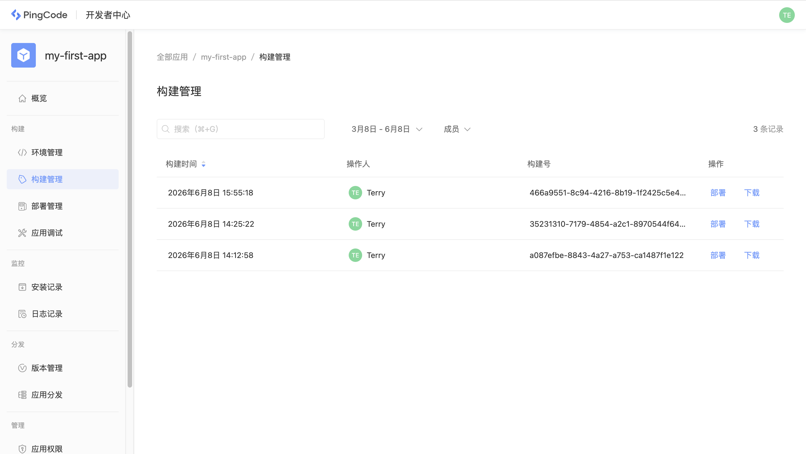

# 应用构建

应用构建是指对应用代码打包并上传至 Nexus 平台，构建结果与部署环境无关，可用于部署至任何环境。

## 构建过程

每次构建过程中会为本次构建分配唯一的构建号，该构建号可由用户手工指定，如没有指定则由系统自动生成。

如下面的命令将执行构建，并指定构建号为 `7d392hf` ：

```
nexus build -t 7d392hf
```

默认情况下构建时将运行预构建检查，验证 `manifest.yaml` 并报告任何编译错误，如果想跳过预检查直接构建，可以使用：

```
nexus build --no-verify
```

## 构建结果

每次构建结果都会在构建管理中生成一条历史记录，可通过开发者中心进行查看与管理：


