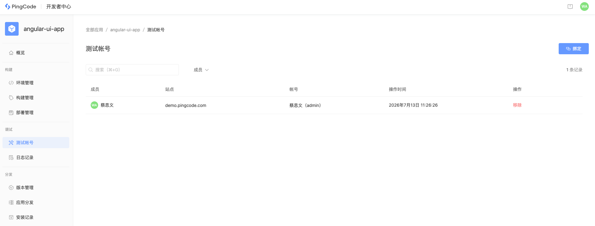

# 应用调试

本指南详细阐述如何在开发环境调试 Nexus 应用。Nexus 平台提供本地调试、日志查看与 IDE 断点调试等能力，帮助你在不反复部署的情况下快速验证和排查问题。

## 开始之前

开始调试前，请确认已完成以下步骤：

1. **部署应用** ：将应用部署到开发环境。
1. **安装应用** ：将应用 [分发并安装](/guide/started/deploy-and-install) 到目标 PingCode 站点。
1. **绑定测试帐号** ：完成 PingCode 调试帐号绑定。



::: info
nexus serve 命令通过安全的双向隧道机制，将本地应用代码与 Nexus 远端开发环境中的已安装应用实例建立实时映射。当你在 PingCode 宿主环境中操作该应用时，系统会自动将应用请求转发到启动的本地服务中，从而实时执行本地的后端逻辑并加载最新的前端资源。
:::

## 启动服务

启动本地服务，在应用目录终端执行命令：

```shell
nexus serve -e development
```

如未绑定测试帐号，则提示需要打开绑定页面进行帐号绑定：

```shell
✔ Select target environment: development

⚠ Warning: PingCode account not bound yet.

? Do you want to open the browser to bind your account? (Y/n)

✔ Do you want to open the browser to bind your account? Yes
```

出现如下提示表示本地服务启动成功：

```javascript
✔ Select target environment: development
✓ Connected to development.
  
Listening for requests...
```

## 代码更新与热重载

### 后端代码更新

`serve` 命令默认实时监听 `app/src` 目录。当该目录下的源码发生变化后，系统会自动更新代码并重启本地服务。

```javascript
Code changes detected. Listening for requests...
```

### 前端代码更新

**静态构建**

若 `manifest.yaml` 中直接指定了构建后的静态前端资源，当代码变更后，需要重新执行前端的 `build` 编译命令，然后刷新 PingCode 站点页面查看变更。 

**配置前端热更新（HMR）**

若希望在前端开发过程中使用热更新（HMR），可在本地启动前端框架提供的 Dev Server（如 Angular 的 `ng serve` 或 Vite 的 `vite` ）后，在应用根目录下创建 `nexus.json` 配置文件，指定前端资源 `key` 指向 Dev Server 启动端口。

```javascript
{
  "serve": {
    "resources": {
      "main": { "port": 5173 }
    }
  }
}
```

::: info
配置项中的 
`main`
 必须与 
`manifest.yaml`
 中声明的 
`resources`
 下的 
`key`
 保持绝对一致。
:::

### **manifest.yaml 更新**

`manifest.yaml` 修改后，部分配置值可能不会立即生效，为了避免配置未生效导致调试出错，建议变更后重新执行 `nexus deploy` 进行部署更新。

## 调试指定函数

使用  `--function`  参数可调试指定的函数，参数值为  `manifest.yaml`  定义的  `functions[].key` ，支持指定多个 key，用空格进行分割。

```shell
# 仅调试 resolver handler
nexus serve --function resolver

# 同时调试 resolver 与某个 event handler
nexus serve --function resolver my-event-handler
```

## Event 调试

Event 函数同样也可以通过 `nexus serve` 进行本地调试，与 Resolver 函数不同的是， **Event 函数调试与测试帐号绑定关系无关，永远匹配最近一次建立隧道连接的本地服务** 。

Event 没有 UI，需要用户在 PingCode 或外部真实触发对应事件来触发调用：

- **系统事件** ：执行订阅的操作（如创建工作项）
- **Webhook** ：向 Webhook URL 发送 HTTP 请求
- **定时触发器** ：等待到达配置的执行间隔
- **生命周期事件** ：触发安装、升级或卸载等
