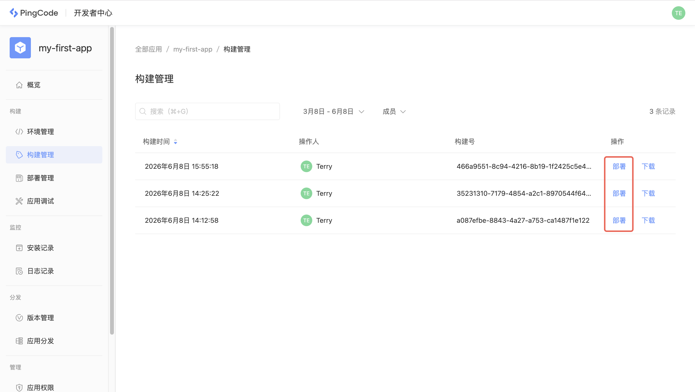
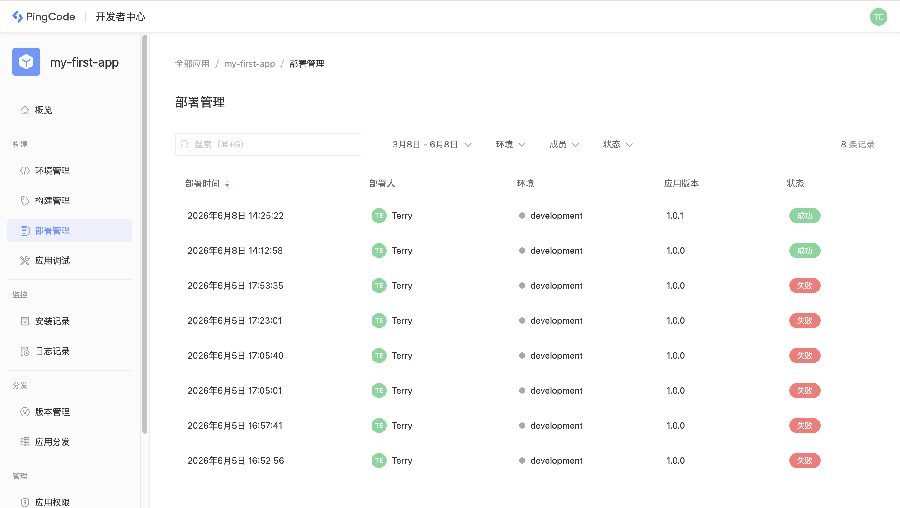
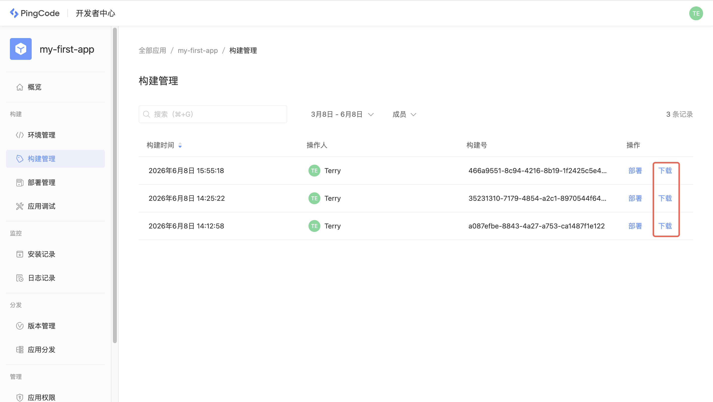

# 应用部署

应用部署是指部署应用代码到具体的运行环境中，本文档将分别介绍在公有云和私有部署环境中如何部署应用。

## 公有云部署

在 PingCode 公有云环境中运行应用，需要先部署应用到公有云运行环境，部署时可以基于上面的某个构建结果部署，也可以选择直接部署，直接部署时将会生成一条新的构建结果。

通过 CLI 部署，不指定构建结果：

```
nexus deploy -e development
```

通过 CLI 部署，基于构建号 `466a9551` ：

```
nexus deploy -e development -t 466a9551
```

通过开发者中心部署，在「构建管理」中选择想要部署的构建记录，点击「部署」并选择运行环境：



在部署管理中可以查看每一次的部署结果：



## 私有部署

在 PingCode 私有部署环境中运行应用，需要首先生成应用安装包，并通过企业管理后台上传，在上传后应用会自动执行部署。

通过 CLI 生成安装包，使用 `packup` 命令：

```
nexus packup
```

通过开发者中心，在「构建管理」中选择想要生成安装包的构建记录，点击「下载」即可生成安装包：



在企业管理后台，进入「应用审核」列表，点击「上传应用」选择对应的安装包即可。
