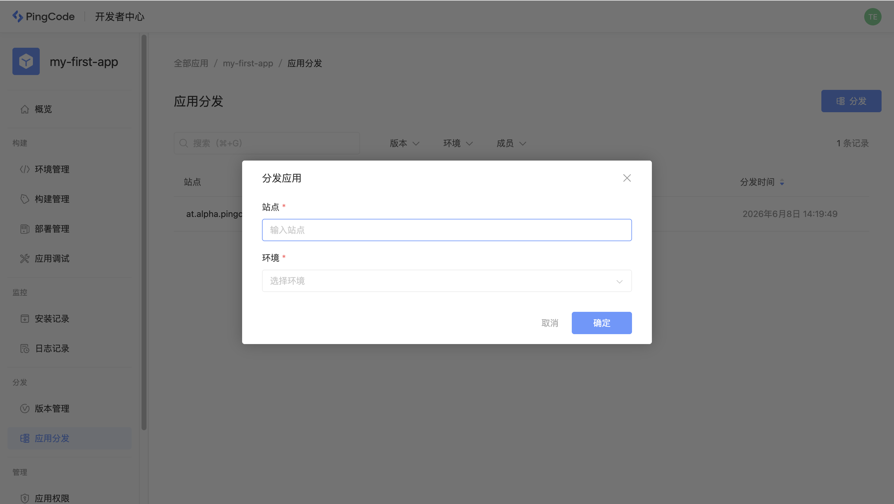
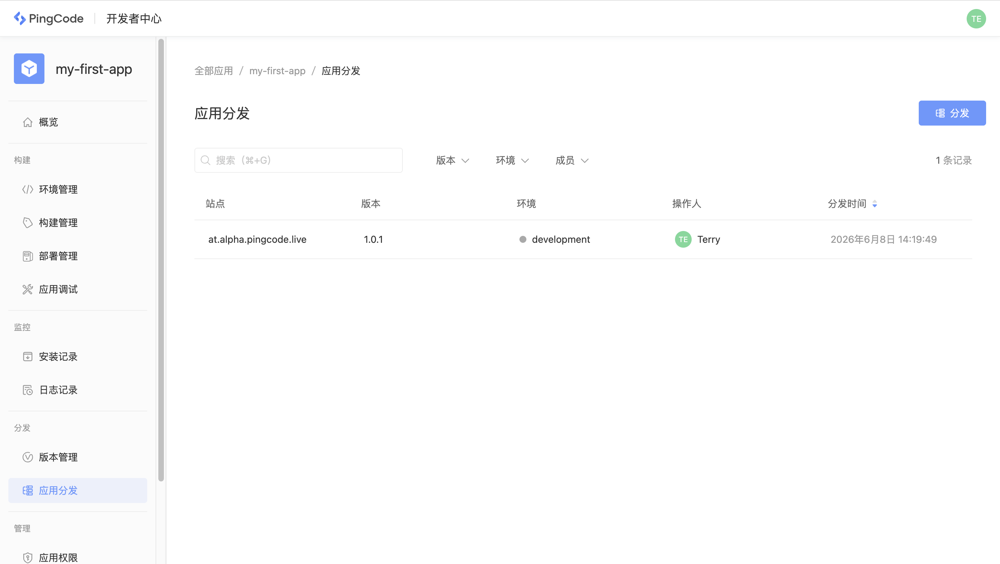
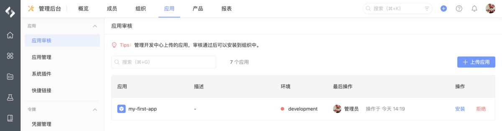

# 应用分发

应用分发是在应用开发完成后，分发到自己的企业进行测试，或者分发给其他企业进行使用。完成应用分发后，管理员在企业管理后台的「应用审核」列表中能够看到此应用，可以选择是否安装。

## 公有云

如果应用运行在公有云环境中，可以通过 CLI 或者开发者中心进行分发。

通过 CLI 分发，需要指定应用运行环境和要分发的企业站点 URL：

```javascript
nexus distribute -s at.alpha.pingcode.live -e development
```

通过开发者中心分发，输入企业站点 URL并选择环境：



同一个应用如果部署在不同的环境，针对同一个企业站点，可以根据环境不同多次分发。分发后会在开发者中心留存每一次分发记录：



## 私有部署

如果应用运行在私有部署环境中，首先要对应用代码进行打包，生成应用安装包，参考 [应用部署](/guide/build/app-deploy) 。

安装包为 `npk` 文件：

```javascript
my-first-app_v1.0.1_466a95.npk
```

生成安装包后，进入企业管理后台，在「应用审核」列表中上传此安装包：


