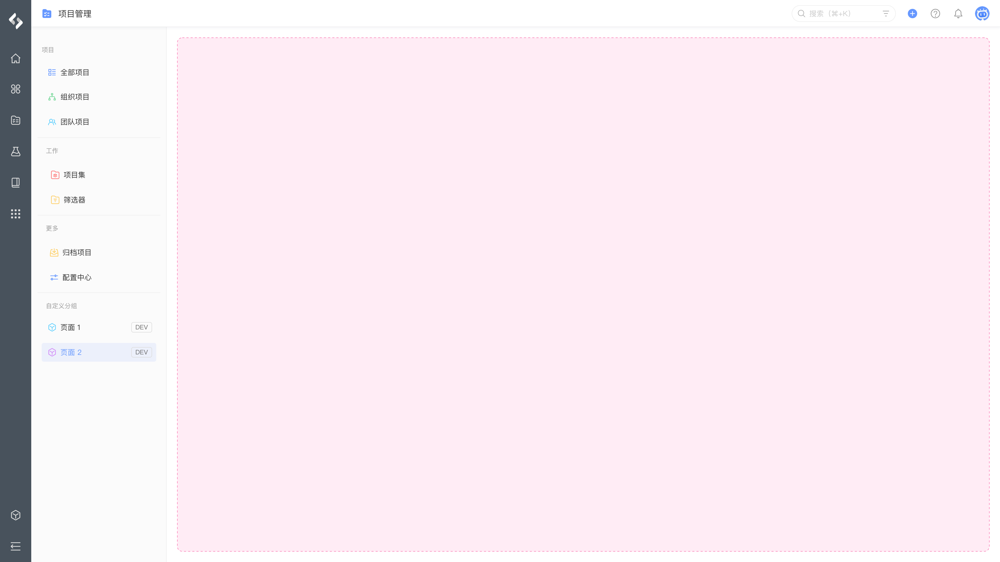
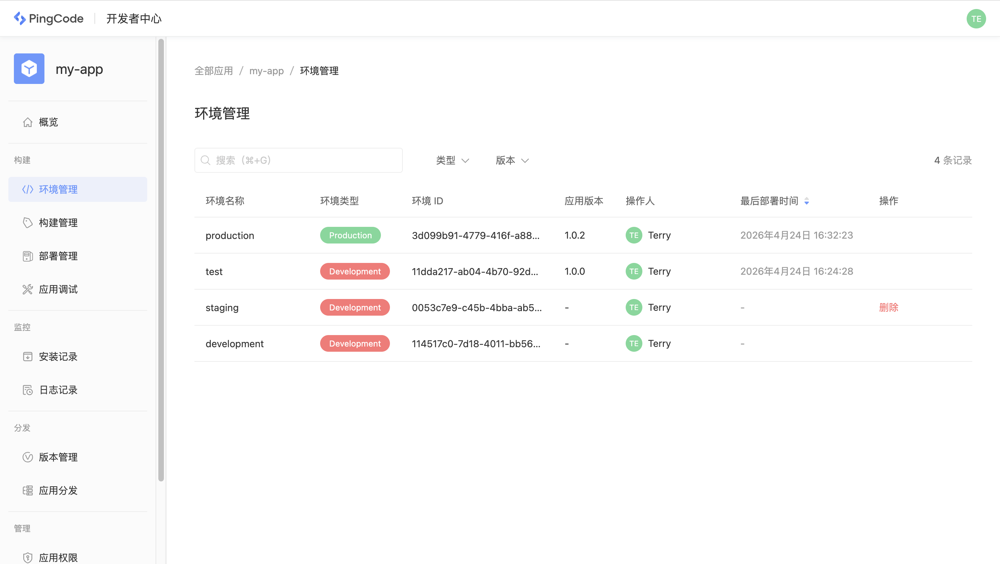

# 环境管理

环境是部署应用的地方，当应用部署在某个环境中运行时，可以通过 CLI 将当前环境下的应用分发到 PingCode 具体的企业安装使用。

## 环境说明

应用运行环境支持三种类型：

- `Development` ：开发环境，用于开发阶段测试应用的更改
- `Staging` ：预发布环境，用于部署应用的稳定版本
- `Production` ：生产环境，用于部署可供正式使用版本

在创建一个新的应用时，平台默认会为当前应用创建一个开发环境、一个预发布环境、一个生产环境，可以自行创建更多的开发环境。当应用部署到开发环境时，其标题会带有 `DEV` 标识，一旦将应用部署到预发布环境和生产环境，其标题将不再带有任何标识。

## 环境管理

每个应用可以同时创建多个开发环境，但只能拥有一个预发布环境和一个生产环境，且不能被删除。你可以使用 CLI 的 `nexus environments` 命令管理及查看应用环境，也可以在开发者中心进行查看管理：

## 环境限制

针对不同的环境类型，平台会有特定的限制，具体如下： 

|环境类型|Development|Staging|Production|
|---|---|---|---|
|环境类型定位|进行开发阶段的调试|用于部署应用稳定版本|用于部署可供正式使用版本|
|是否支持创建多个|✅|❌|❌|
|是否允许开启调试|✅|❌|❌|
|打印日志到 CLI|✅|❌|❌|
|部署时是否允许版本号不升级|✅|❌|❌|
|允许自行部署|✅|✅|❌|
|是否允许开发者访问日志|✅|取决于企业设置|取决于企业设置|
|数量限制|`16`|`1`|`1`|
