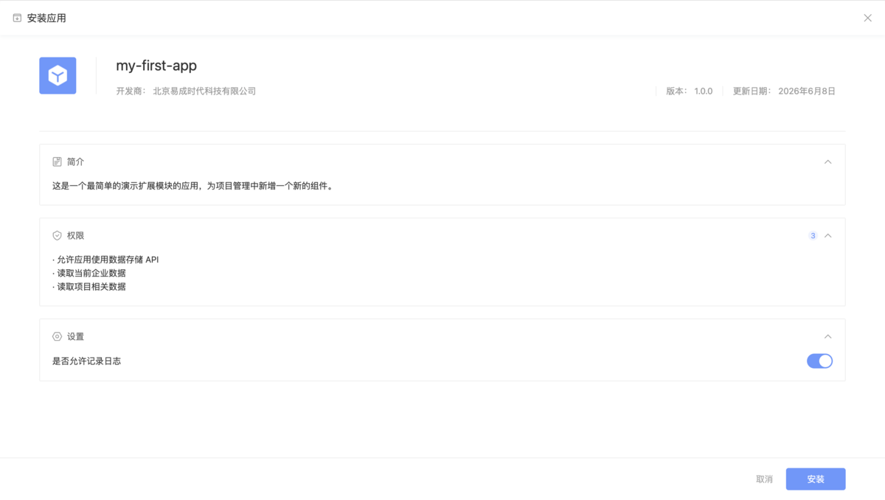
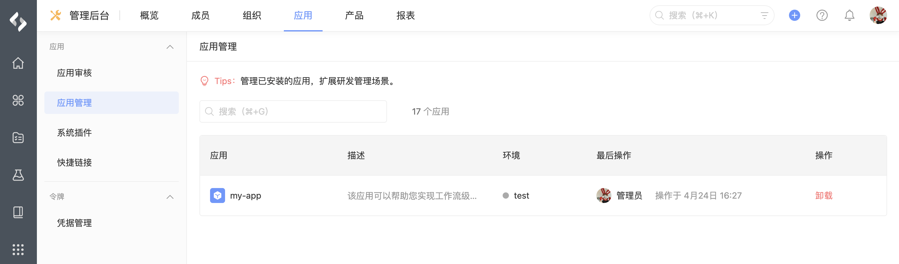

# 安装卸载

本文档介绍开发完成的应用如何在 PingCode 产品中进行安装与卸载。

## 应用安装

每个开发完成的应用，无论是通过哪种方式分发到企业，都会在企业管理后台的「应用审核」列表中出现：

点击「安装」按钮可以将应用安装到当前企业：

在安装界面，作为企业管理员能够看到应用的基本信息，以及应用对数据的操作权限，以决定是否安装。同时，还可以设置是否允许应用记录日志。

## 应用卸载

当前企业安装的所有应用，都可以通过「应用管理」列表进行卸载。

