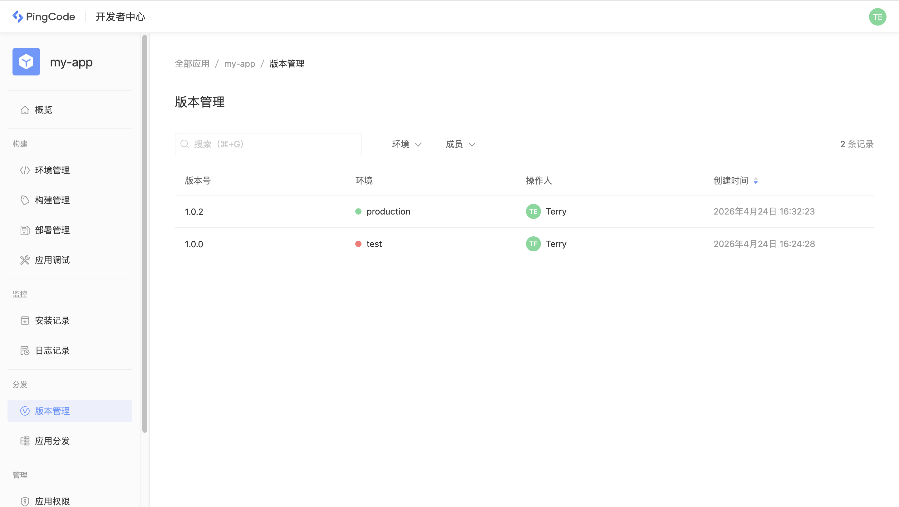

# 版本管理

每个应用都需要指定版本号进行版本管理，在开发应用过程中需要遵循 Nexus 版本管理规则。

## 版本号

应用的版本号由开发者在 `manifest.yaml` 文件中通过 `version` 属性指定：

```yaml
app:
  id: "4abd2038-a42c-49a1-b98c-ae04e29bf57a"
  version: 2.0.0
```

版本号遵循语义化版本规范，格式为 `主版本号.次版本号.修订号（如 2.0.0）` ，用于标识应用的发布状态与兼容性。

## 版本管理

每次部署应用新版本时，根据部署的环境不同，需要遵循以下版本号规则：

- 部署到 `Development` 环境时，版本号必须不低于原来的版本号
- 部署到 `Production` 环境时，版本号必须高于原来的版本号

应用每次部署时，如果有新的版本号产生，都会在开发者中心版本管理中展示，帮助开发者查看应用每次发布的版本：



## 应用升级

应用有新的版本发布时，根据部署方式不同会有不同的升级策略：

<table style="width: 100%; table-layout: fixed"><colgroup><col style="width: 24.72%" /><col style="width: 75.28%" /></colgroup><thead><tr><th>部署方式</th><th>升级策略</th></tr></thead><tbody><tr><td>公有云</td><td>当应用新版本部署到对应的环境时，所有安装了此应用的企业，都会自动升级应用到最新版本。</td></tr><tr><td>私有部署</td><td>当应用有新版本发布时，需要打包最新的应用程序，在企业后台管理中上传最新应用部署包进行升级。</td></tr></tbody></table>
