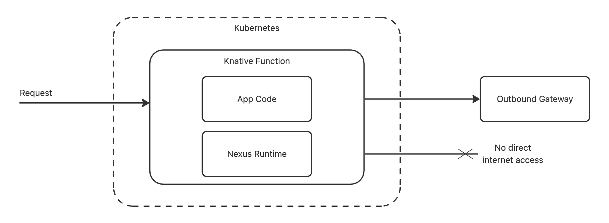

# 应用架构

Nexus 平台是 PingCode 的云端应用开发平台，允许开发者将应用托管在由 PingCode 自动配置、管理、监控和扩展的基础设施上，开发者不再需要自行配置托管服务或数据库。开箱即用的完整托管与开发环境，以及一套支持从简单到复杂场景的构建模块，一应俱全。

## 核心组件

Nexus 平台提供了一套完整的工具包，用于扩展 PingCode 产品，有几个核心组件需要掌握。

### 清单文件

清单文件 `manifest.yaml` 是每个 Nexus 应用的核心配置文件，使用 YAML 格式，负责描述应用的元数据、扩展模块、事件订阅、访问权限以及应用的唯一标识，该文件必须存在于每个应用源代码的根目录下且文件名不能修改。更多详情请参考：

- [Manifest](/guide/development/architecture-manifest)

### 扩展模块

扩展模块是在应用的 `manifest.yaml` 文件中定义的组件，它通过定义与 PingCode 产品内扩展点相对应的属性和行为，来规定您的应用如何与产品集成。更多详情请参考：

- [扩展模块](/guide/development/architecture-extensions)

### 事件订阅

Nexus 应用可以订阅事件或设置一个 HTTP 端点，以便在没有用户交互的情况下调用应用内的某个函数，使的应用能够响应 PingCode 产品和 Nexus 平台后台发生的活动，无论这些活动是由用户主动触发的，还是由其他后台处理（例如基于 REST APIs 的脚本对你的项目进行批量更新）触发的。更多详情请参考：

- [事件订阅](/guide/development/architecture-events)

## 设计原则

在设计 Nexus 应用时，有一些基本的原则需要遵循：

- 根据请求和授予的范围，读取/写入所有用户生成内容
- 无法访问 PingCode 产品用户的登录凭据或会话
- 除非授予所需范围，否则访问 PingCode REST APIs 会被拒绝
- 不可以更改 PingCode 产品用户的身份属性，如用户权限或密码

## 应用安全

控制应用运行时对安全至关重要。Nexus 运行时将应用与其执行环境相隔离。通过在隔离环境中运行应用，平台限制了应用可执行的操作。如：

- 应用不得干扰或修改其他正在运行的应用。
- 除应用清单中定义的出站权限所允许的情况外，应用不得向互联网发起请求。

Nexus 应用环境示意图如下所示：

App Code：开发者编写的应用代码

Nexus Runtime：Nexus 平台提供的运行时
