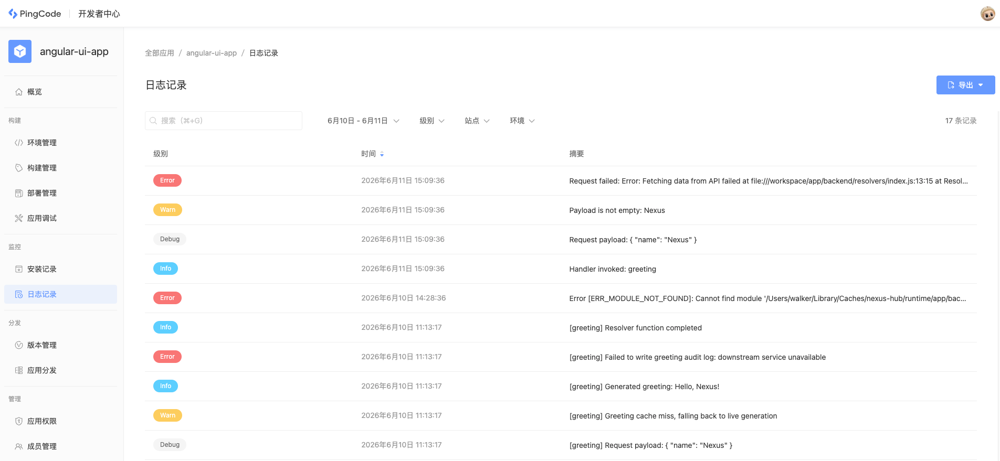

# 日志记录

Nexus 平台提供了完善的日志记录能力，允许每个应用记录自己的日志信息。

## 日志记录

在服务端函数（如 Resolver、Event Handler）中，使用以下方法即可记录日志：

<table style="width: 100%; table-layout: fixed"><colgroup><col style="width: 55.37%" /><col style="width: 44.63%" /></colgroup><thead><tr><th>方法</th><th>日志级别</th></tr></thead><tbody><tr><td><code>console.log()</code></td><td><code>Info</code></td></tr><tr><td><code>console.info()</code></td><td><code>Info</code></td></tr><tr><td><code>console.debug()</code></td><td><code>Debug</code></td></tr><tr><td><code>console.warn()</code></td><td><code>Warn</code></td></tr><tr><td><code>console.error()</code></td><td><code>Error</code></td></tr></tbody></table>

平台会自动采集这些输出，并附带调用上下文信息（如 Invocation ID、函数标识、应用版本等）。

### 示例

```typescript
import { Resolver } from "@pc-nexus/core";

const resolver = new Resolver();

resolver.define<string, string>("greeting", async (context, payload) => {
    console.log("Handler invoked: greeting");

    console.debug("Request payload:", JSON.stringify({ name: payload }, null, 2));

    if (payload?.trim()) {
        console.warn(`Payload is not empty: ${payload}`);
    } else {
        console.info(`Invoked with payload: ${payload}`);
    }
    
    try {
        throw new Error("Fetching data from API failed");
    } catch (error) {
        console.error("Request failed:", error);
    }

    return `Hello, ${payload}!`;
});

export { resolver };

```

应用部署成功并触发执行后，即可在 CLI 或开发者中心实时查看。

### 注意事项

- 仅服务端函数中的 `console` 输出会出现在平台日志中，UI 等前端日志需通过浏览器开发者工具查看。
- 未捕获的运行时异常会自动记录为 `Error` 级别，并包含堆栈信息。
- 请勿在日志中输出敏感信息（访问令牌、用户凭证、个人隐私数据等）。
- 如需格式化输出 JSON 对象，建议使用 `JSON.stringify(obj, null, 2)` 。

## 日志查看

### 通过 CLI 查看

在应用项目目录下运行 `nexus logs` ，即可查看已部署应用的运行日志。CLI **仅支持开发环境** 。

```shell
nexus logs
```

默认输出示例（每条日志包含级别、时间、Invocation ID 和消息）：

```textile
Info     2026-06-11T07:09:36.629Z    a446d3c3-c942-4038-8cbf-e8bbdc84544a    Handler invoked: greeting
Warn     2026-06-11T07:09:36.631Z    a446d3c3-c942-4038-8cbf-e8bbdc84544a    Payload is not empty: Nexus
Debug    2026-06-11T07:09:36.630Z    a446d3c3-c942-4038-8cbf-e8bbdc84544a    Request payload:
{
  "name": "Nexus"
}
```

同一 Invocation ID 下的日志属于同一次函数调用。使用 `--grouped` 按 Invocation ID 分组展示：

```shell
nexus logs --grouped
```

```textile
Invocation: a446d3c3-c942-4038-8cbf-e8bbdc84544a
Info     2026-06-11T07:09:36.629Z    a446d3c3-c942-4038-8cbf-e8bbdc84544a    Handler invoked: greeting
Warn     2026-06-11T07:09:36.631Z    a446d3c3-c942-4038-8cbf-e8bbdc84544a    Payload is not empty: Nexus
Debug    2026-06-11T07:09:36.630Z    a446d3c3-c942-4038-8cbf-e8bbdc84544a    Request payload:
{
  "name": "Nexus"
}

Invocation: 916d0203-22f5-446d-985f-421ff68bb89a
Info     2026-06-10T03:10:42.503Z    916d0203-22f5-446d-985f-421ff68bb89a    [greeting] Resolver function completed
Info     2026-06-10T03:10:42.502Z    916d0203-22f5-446d-985f-421ff68bb89a    [greeting] Generated greeting: Hello, Nexus!
```

常用选项：

|选项|说明|
|---|---|
|`-g, --grouped`|按 Invocation ID 分组|
|`-v, --verbose`|显示应用版本、函数标识等元数据|
|`-i, --invocation [id]`|查看指定调用的日志|
|`-e, --environment [env]`|指定环境|

更多 Logs 命令说明详见 [logs](/reference/cli/logs) 。

### 通过开发者中心查看

1. 进入开发者中心，打开目标应用。
1. 在左侧菜单选择 **监控** > **日志记录** 。



页面将展示当前开发者拥有访问权限站点的日志，支持通过搜索框、时间范围、日志级别、站点和环境筛选日志，也可将结果导出为 `.csv` 或 `.log` 格式。

### 日志字段

展开日志详情后，可查看该条日志的全部属性：

<table style="width: 100%; table-layout: fixed"><colgroup><col style="width: 30.86%" /><col style="width: 69.14%" /></colgroup><thead><tr><th>字段</th><th>说明</th></tr></thead><tbody><tr><td>级别</td><td>日志级别： <code>Info</code> 、 <code>Debug</code> 、 <code>Warn</code> 、 <code>Error</code></td></tr><tr><td>时间</td><td>日志创建时间</td></tr><tr><td>详情</td><td>完整的日志消息内容</td></tr><tr><td><code>Environment</code></td><td>应用运行的环境名</td></tr><tr><td><code>Invocation ID</code></td><td>单次函数调用的唯一标识，同一调用产生的日志共享此 ID</td></tr><tr><td><code>Trace ID</code></td><td>请求追踪标识，可用于关联不同调用或远程 API 请求</td></tr><tr><td><code>Extension</code></td><td>产生日志的扩展模块标识（对应 <code>manifest</code> 中的 <code>extensions.key</code> ）</td></tr><tr><td><code>Event Trigger</code></td><td>触发日志的事件标识（对应 <code>manifest</code> 中的 <code>event.triggers.key</code> ）</td></tr><tr><td><code>Function</code></td><td>产生日志的函数标识（对应 <code>manifest</code> 中的 <code>functions.key</code> ）</td></tr><tr><td><code>Version</code></td><td>应用安装版本号</td></tr><tr><td><code>Site</code></td><td>应用被调用的站点地址</td></tr></tbody></table>

## 日志访问

### 访问设置

能否查看日志取决于应用环境与安装设置：

- **开发环境** ：默认允许日志记录，不允许关闭，开发者可查看所有安装站点日志。
- **生产环境** ：日志记录权限由站点应用管理员配置，管理员可在安装时或安装后在应用详情页开启或关闭 `是否允许记录日志` 配置。


应用开发者角色决定了可查看和导出的日志范围，具体权限定义详见 [应用访问](/guide/management/app-access) 。

### 数据保留

所有记录的日志数据将会保留 `30天` ，超过日期后日志数据会被永久删除，且无法恢复。
