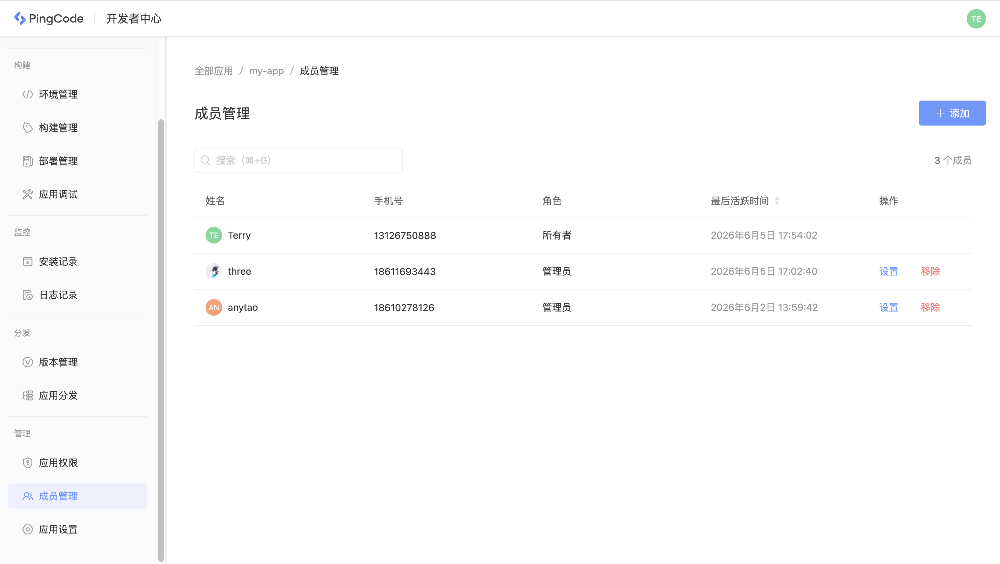

# 应用访问

开发者在创建一个应用后，可以把团队其他成员加入到应用中，共同协作开发。

## 成员管理

在开发者中心的「成员管理」中，可以添加或移除其他成员，并管理成员的角色。

## 成员角色

开发者中心共定义了五种成员角色，每种角色分别对应不同的权限。

### 角色说明

五种角色说明：

<table style="width: 100%; table-layout: fixed"><colgroup><col style="width: 27.82%" /><col style="width: 72.18%" /></colgroup><thead><tr><th>角色</th><th>说明</th></tr></thead><tbody><tr><td>所有者</td><td>创建应用的用户即为应用所有者，所有者具有应用全部权限。</td></tr><tr><td>管理员</td><td>拥有除转让和删除应用外的所有管理权限。</td></tr><tr><td>开发人员</td><td>负责代码开发，开发环境的管理、构建与部署以及应用分发。</td></tr><tr><td>部署人员</td><td>负责开发环境和生产环境的管理与部署以及应用分发。</td></tr><tr><td>只读成员</td><td>仅支持查看应用，无任何操作权限。</td></tr></tbody></table>

### 角色权限

每种角色分别对应不同的权限。

定义每种角色「应用构建」权限：

<table style="width: 100%; table-layout: fixed"><colgroup><col style="width: 16.67%" /><col style="width: 16.67%" /><col style="width: 16.67%" /><col style="width: 16.67%" /><col style="width: 16.67%" /><col style="width: 16.65%" /></colgroup><thead><tr><th>分类</th><th>功能</th><th>管理员</th><th>开发人员</th><th>部署人员</th><th>只读成员</th></tr></thead><tbody><tr><td>环境管理</td><td>查看环境列表</td><td>✅</td><td>✅</td><td>✅</td><td>✅</td></tr><tr><td></td><td>新建开发环境</td><td>✅</td><td>✅</td><td>✅</td><td>❌</td></tr><tr><td></td><td>删除开发环境</td><td>✅</td><td>✅</td><td>✅</td><td>❌</td></tr><tr><td>构建管理</td><td>查看构建列表</td><td>✅</td><td>✅</td><td>✅</td><td>✅</td></tr><tr><td></td><td>新建构建</td><td>✅</td><td>✅</td><td>✅</td><td>❌</td></tr><tr><td></td><td>下载安装包</td><td>✅</td><td>✅</td><td>✅</td><td>❌</td></tr><tr><td>部署管理</td><td>查看部署列表</td><td>✅</td><td>✅</td><td>✅</td><td>✅</td></tr><tr><td></td><td>部署开发环境</td><td>✅</td><td>✅</td><td>✅</td><td>❌</td></tr><tr><td></td><td>部署生产环境</td><td>✅</td><td>❌</td><td>✅</td><td>❌</td></tr></tbody></table>

定义每种角色「应用调试」权限：

<table style="width: 100%; table-layout: fixed"><colgroup><col style="width: 16.67%" /><col style="width: 16.67%" /><col style="width: 16.67%" /><col style="width: 16.67%" /><col style="width: 16.67%" /><col style="width: 16.65%" /></colgroup><thead><tr><th>分类</th><th>功能</th><th>管理员</th><th>开发人员</th><th>部署人员</th><th>只读成员</th></tr></thead><tbody><tr><td>测试帐号</td><td>查看绑定帐号列表</td><td>✅</td><td>✅</td><td>❌</td><td>❌</td></tr><tr><td></td><td>绑定调试帐号</td><td>✅</td><td>✅</td><td>❌</td><td>❌</td></tr><tr><td>日志记录</td><td>查看开发环境日志</td><td>✅</td><td>✅</td><td>✅</td><td>✅</td></tr><tr><td></td><td>查看生产环境日志</td><td>✅</td><td>❌</td><td>✅</td><td>✅</td></tr><tr><td></td><td>导出开发环境日志</td><td>✅</td><td>✅</td><td>✅</td><td>❌</td></tr><tr><td></td><td>导出生产环境日志</td><td>✅</td><td>❌</td><td>✅</td><td>❌</td></tr><tr><td>KVS 存储</td><td>查看 KVS 存储列表</td><td>✅</td><td>✅</td><td>✅</td><td>❌</td></tr><tr><td>CES 存储</td><td>查看 CES 存储列表</td><td>✅</td><td>✅</td><td>✅</td><td>❌</td></tr><tr><td>NOS 存储</td><td>查看 NOS 存储列表</td><td>✅</td><td>✅</td><td>✅</td><td>❌</td></tr></tbody></table>

定义每种角色「应用分发」权限：

<table style="width: 100%; table-layout: fixed"><colgroup><col style="width: 16.67%" /><col style="width: 16.67%" /><col style="width: 16.67%" /><col style="width: 16.67%" /><col style="width: 16.67%" /><col style="width: 16.65%" /></colgroup><thead><tr><th>分类</th><th>功能</th><th>管理员</th><th>开发人员</th><th>部署人员</th><th>只读成员</th></tr></thead><tbody><tr><td>版本管理</td><td>查看版本列表</td><td>✅</td><td>✅</td><td>✅</td><td>✅</td></tr><tr><td>应用分发</td><td>查看分发列表</td><td>✅</td><td>✅</td><td>✅</td><td>✅</td></tr><tr><td></td><td>分发应用</td><td>✅</td><td>✅</td><td>✅</td><td>❌</td></tr><tr><td>安装记录</td><td>查看安装列表</td><td>✅</td><td>✅</td><td>✅</td><td>✅</td></tr></tbody></table>

定义每种角色「应用管理」权限：

<table style="width: 100%; table-layout: fixed"><colgroup><col style="width: 16.67%" /><col style="width: 16.67%" /><col style="width: 16.67%" /><col style="width: 16.67%" /><col style="width: 16.67%" /><col style="width: 16.65%" /></colgroup><thead><tr><th>分类</th><th>功能</th><th>管理员</th><th>开发人员</th><th>部署人员</th><th>只读成员</th></tr></thead><tbody><tr><td>应用权限</td><td>查看权限列表</td><td>✅</td><td>✅</td><td>✅</td><td>✅</td></tr><tr><td>成员管理</td><td>查看成员列表</td><td>✅</td><td>✅</td><td>✅</td><td>✅</td></tr><tr><td></td><td>添加成员</td><td>✅</td><td>❌</td><td>❌</td><td>❌</td></tr><tr><td></td><td>移除成员</td><td>✅</td><td>❌</td><td>❌</td><td>❌</td></tr><tr><td></td><td>设置成员角色</td><td>✅</td><td>❌</td><td>❌</td><td>❌</td></tr><tr><td>应用设置</td><td>修改应用信息</td><td>✅</td><td>❌</td><td>❌</td><td>❌</td></tr><tr><td></td><td>转让应用</td><td>❌</td><td>❌</td><td>❌</td><td>❌</td></tr><tr><td></td><td>删除应用</td><td>❌</td><td>❌</td><td>❌</td><td>❌</td></tr></tbody></table>

## 访问令牌

通过 CLI 访问应用时需要通过访问令牌登录，不同的令牌可以设置不同的权限范围，CLI 命令和权限范围的对应关系如下：

<table style="width: 100%; table-layout: fixed"><colgroup><col style="width: 18.93%" /><col style="width: 31.07%" /><col style="width: 25%" /><col style="width: 25%" /></colgroup><thead><tr><th>范围</th><th>命令</th><th>只读</th><th>读写</th></tr></thead><tbody><tr><td>环境管理</td><td><code>environments create</code></td><td>❌</td><td>✅</td></tr><tr><td></td><td><code>environments delete</code></td><td>❌</td><td>✅</td></tr><tr><td></td><td><code>environments list</code></td><td>✅</td><td>✅</td></tr><tr><td>构建管理</td><td><code>nexus build</code></td><td>❌</td><td>✅</td></tr><tr><td></td><td><code>nexus build list</code></td><td>✅</td><td>✅</td></tr><tr><td></td><td><code>nexus packup</code></td><td>❌</td><td>✅</td></tr><tr><td>部署管理</td><td><code>nexus deploy</code></td><td>❌</td><td>✅</td></tr><tr><td></td><td><code>nexus deploy list</code></td><td>✅</td><td>✅</td></tr><tr><td></td><td><code>nexus distribute</code></td><td>❌</td><td>✅</td></tr><tr><td>应用调试</td><td><code>nexus serve bind</code></td><td>❌</td><td>✅</td></tr><tr><td></td><td><code>nexus serve list</code></td><td>✅</td><td>✅</td></tr><tr><td></td><td><code>nexus serve</code></td><td>❌</td><td>✅</td></tr><tr><td></td><td><code>nexus logs</code></td><td>✅</td><td>✅</td></tr></tbody></table>
