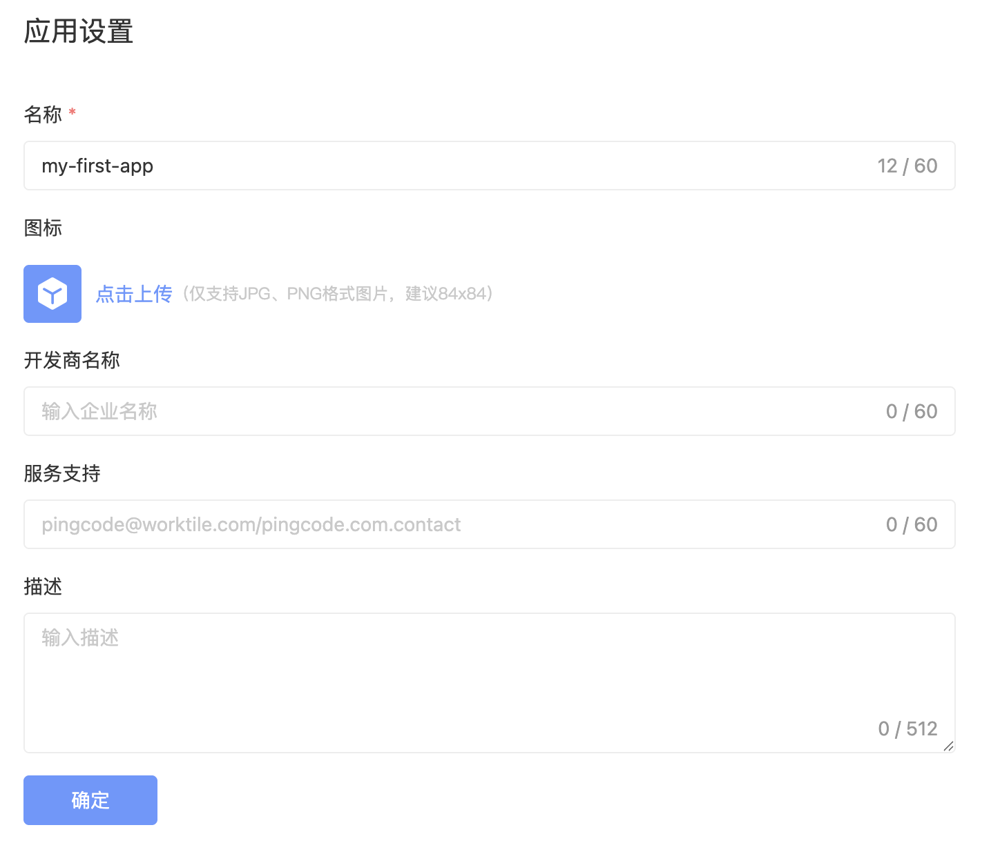
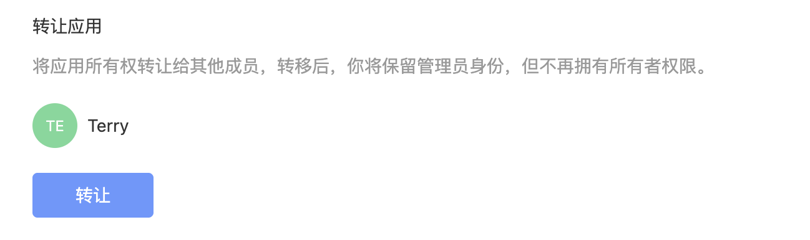
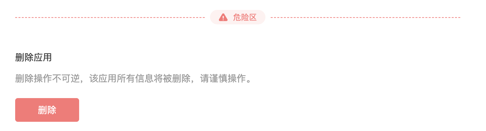

# 应用设置

设置应用的元数据以及管理应用。

## 基本设置

在应用「基本设置」中可以维护应用的元数据，这些属性会在 CLI 构建时自动打包到应用的元数据文件 `manifest.yaml` 中。

各个字段对应的属性如下：

<table style="width: 100%; table-layout: fixed"><colgroup><col style="width: 22.03%" /><col style="width: 20.93%" /><col style="width: 57.04%" /></colgroup><thead><tr><th>字段</th><th>元数据属性</th><th>描述</th></tr></thead><tbody><tr><td>名称</td><td><code>name</code></td><td>定义应用的名称</td></tr><tr><td>开发商</td><td><code>publisher</code></td><td>应用的开发商，对外展示的企业名称</td></tr><tr><td>描述</td><td><code>description</code></td><td>应用的简单描述</td></tr><tr><td>图标</td><td><code>avatar</code></td><td>应用图标</td></tr><tr><td>服务支持</td><td><code>links.support</code></td><td>应用技术支持链接，可以是支持网站或者邮箱</td></tr></tbody></table>

## 应用转让

应用的创建者默认为当前应用的所有者，如果需要把应用转让给其他成员，可以使用应用「转让」功能，转让后你将保留管理员身份，但不再拥有所有者权限。

## 应用删除

如果应用不再维护，可以使用应用「删除」功能，删除后当前应用所有信息都将被删除。如果当前应用已经有 PingCode 企业安装，则应用无法删除，需要使用的企业卸载后方可删除。

