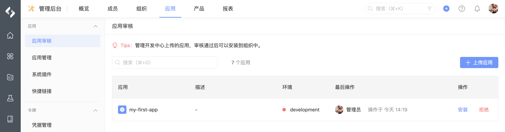
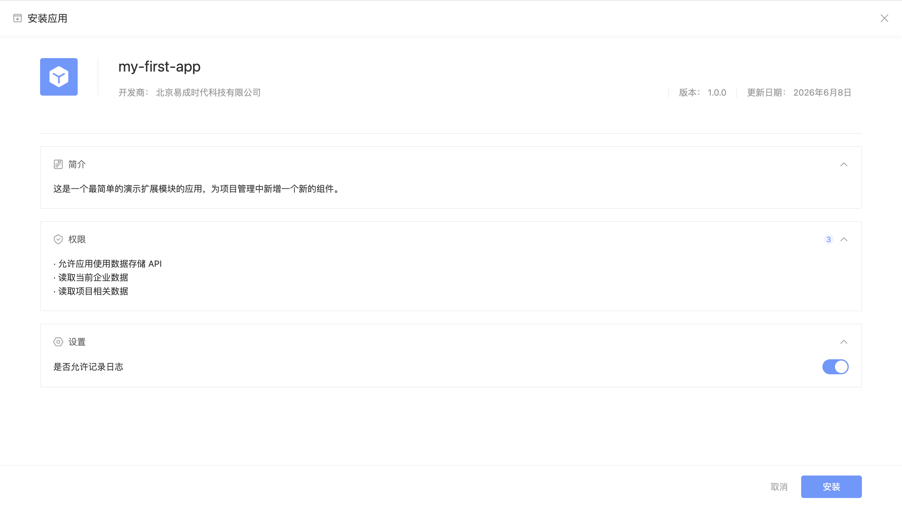
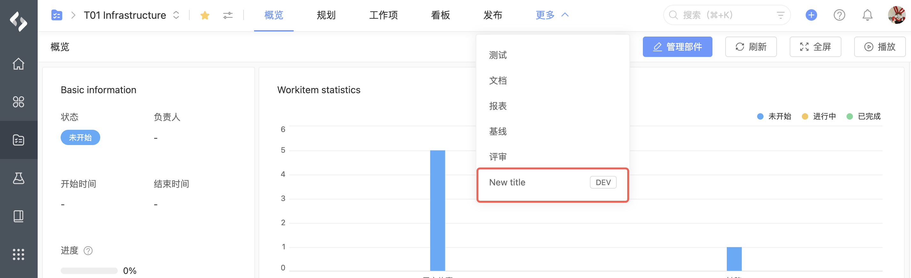

# 部署安装

应用开发完成后，需要将其部署到云端环境并在 PingCode 企业中安装才可以使用。

## 部署应用

在执行部署前首先要构建你的前端代码：

```shell
npm run build-web
```

将本地代码编译并部署到 PingCode 云端开发环境 `development` ，执行命令：

```shell
nexus deploy -e development
```

出现如下提示表示应用已经成功部署到开发环境 `development` 中：

```shell
ℹ Manifest is valid.
ℹ Lint passed.
ℹ Packaged successfully.
ℹ Uploaded successfully.

✔ Deploy completed successfully.
```

## 分发应用

在成功部署应用后，我们需要把应用分发到 PingCode 某个企业中进行安装，执行命令：

```shell
nexus distribute -s {your-domain}.pingcode.com -e development
```

分发成功后，进入企业管理后台，在「应用审核」列表中可以看到当前应用：



## 安装验证

应用需要在 PingCode 企业中安装才可以使用，在「应用审核」列表中安装当前应用：



安装成功后，进入项目，就可以看到我们创建的扩展应用，在项目中新增了一个名为「New title」的组件：



当修改了 `src/` 下的代码后，只需再次运行 `nexus deploy`  命令，选择 与上次相同的开发环境即可同步更改。

 恭喜你完成了第一个 Nexus 应用的开发！
