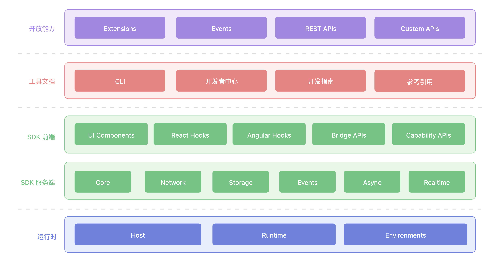

# 什么是 Nexus

Nexus 平台是 PingCode 团队提供的一个开发者平台，提供一系列的代码框架、工具集和运行时，让开发者能够在 PingCode 产品上开发出插件应用，以提高产品的扩展能力。

## 平台架构

Nexus 平台包括开放能力、工具文档、SDK以及运行时：

## 平台特性

- 开发效率
  - 完全基于公有云环境进行开发
  - 提供完善的代码框架和工具集
  - 提供所见即所得的开发调试体验
- 部署能力
  - 支持完全托管类型的应用，应用代码以 FaaS 的形式运行在 PingCode 基础设施上
  - 应用支持公有云/私有部署两种部署方式
  - 完全托管的数据存储服务，无须自建数据库

## 阅读指引

下表可以帮助你更好的了解 Nexus 平台提供的文档结构。

<table style="width: 100%; table-layout: fixed"><colgroup><col style="width: 23.59%" /><col style="width: 24.86%" /><col style="width: 51.55%" /></colgroup><thead><tr><th>分类</th><th>文档</th><th>描述</th></tr></thead><tbody><tr><td>开发指南</td><td><a href="https://developer.pingcode.com/guide/started/what-is-nexus">开发指南</a></td><td>Nexus 应用开发手册</td></tr><tr><td>参考引用</td><td><a href="https://developer.pingcode.com/reference/cli/overview">CLI</a></td><td>Nexus CLI 支持的命令及其使用说明</td></tr><tr><td></td><td><a href="https://developer.pingcode.com/reference/manifest/overview">Manifest</a></td><td>Manifest 文件配置详细说明</td></tr><tr><td></td><td><a href="https://developer.pingcode.com/reference/sdk/overview">SDK</a></td><td>Nexus 应用前后端 SDK 使用说明</td></tr><tr><td></td><td><a href="https://developer.pingcode.com/reference/reference/overview">Reference</a></td><td>提供扩展模块、系统事件等详细定义</td></tr><tr><td>接口文档</td><td><a href="https://developer.pingcode.com/restapi/pingcode/overview">PingCode APIs</a></td><td>PingCode 产品提供的 REST APIs 说明</td></tr><tr><td></td><td><a href="https://developer.pingcode.com/restapi/nexus/overview">Nexus APIs</a></td><td>Nexus 平台提供的 REST APIs 说明</td></tr></tbody></table>
