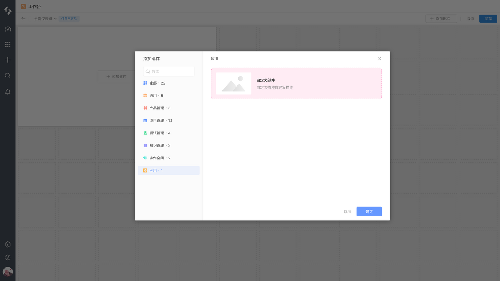
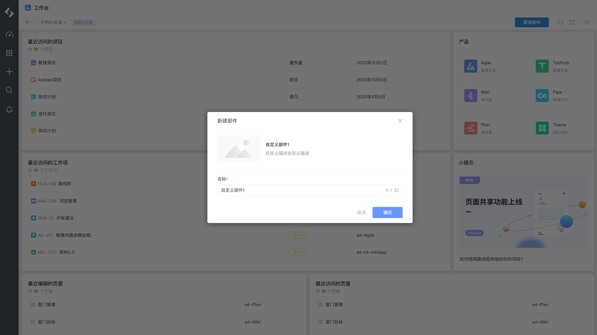
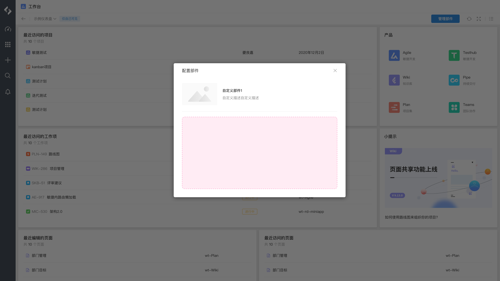

# 工作台 - 仪表盘部件

仪表盘部件扩展模块，允许在仪表盘添加自定义部件：








## 配置

配置结构：

```yaml
extensions []
├─ key (string) [Mandatory]
├─ target (string) [Mandatory]
├─ resolver {} [Mandatory]
├─ title (string | i18n) [Mandatory]
├─ description (string | i18n) [Optional]
├─ thumbnail (string) [Optional]
├─ resource (string) [Mandatory]
├─ layout {} [Mandatory]
│  ├─ min (string) [Mandatory]
│  ├─ max (string) [Mandatory]
│  └─ default (string) [Mandatory]
├─ view {} [Mandatory]
│  └─ resource (string) [Mandatory]
└─ edit {} [Mandatory]
   └─ resource (string) [Mandatory]
```

配置示例：

```yaml
extensions:
  - key: example-dashboard-widget
    target: "pcm:global:dashboard:widget"
    resolver:
      function: resolver
    title: Widget title
    description: A sample dashboard widget
    thumbnail: "resource:example-resource/icons/icon.svg"
    resource: main
    layout:
      min: 2 * 2
      max: 5 * 5
      default: 3 * 4
    view:
      resource: main
    edit:
      resource: widgetEditResource
```

## 属性

<table style="width: 100%; table-layout: fixed"><colgroup><col style="width: 17.21%" /><col style="width: 16%" /><col style="width: 11.69%" /><col style="width: 55.1%" /></colgroup><thead><tr><th>属性</th><th>类型</th><th>必填</th><th>描述</th></tr></thead><tbody><tr><td><code>resolver</code></td><td><code>{ function: string }</code>  或 <code>{ endpoint: string }</code></td><td>Y</td><td>定义扩展模块所使用的处理函数： - 指定后端处理函数时使用 <code>function</code> 属性 - 指定远程服务时使用 <code>endpoint</code> 属性</td></tr><tr><td><code>title</code></td><td><code>string \| i18n</code></td><td>Y</td><td>定义扩展模块部件的标题</td></tr><tr><td><code>description</code></td><td><code>string \| i18n</code></td><td></td><td>定义扩展模块部件的描述</td></tr><tr><td><code>thumbnail</code></td><td><code>string</code></td><td></td><td>定义扩展模块部件的缩略图</td></tr><tr><td><code>resource</code></td><td><code>string</code></td><td>Y</td><td>定义扩展模块所使用的资源，内容为 <code>resources</code> 节点的资源引用</td></tr><tr><td><code>layout</code></td><td><code>object</code></td><td>Y</td><td>定义扩展模块部件的尺寸配置</td></tr><tr><td><code>layout.min</code></td><td><code>string</code></td><td>Y</td><td>定义扩展模块部件的最小尺寸</td></tr><tr><td><code>layout.max</code></td><td><code>string</code></td><td>Y</td><td>定义扩展模块部件的最大尺寸</td></tr><tr><td><code>layout.default</code></td><td><code>string</code></td><td>Y</td><td>定义扩展模块部件的默认尺寸</td></tr><tr><td><code>view</code></td><td><code>object</code></td><td>Y</td><td>定义扩展模块部件预览配置</td></tr><tr><td><code>view.resource</code></td><td><code>string</code></td><td>Y</td><td>定义扩展模块所使用的资源，内容为 <code>resources</code> 节点的资源引用</td></tr><tr><td><code>edit</code></td><td><code>object</code></td><td>Y</td><td>定义扩展模块部件编辑配置</td></tr><tr><td><code>edit.resource</code></td><td><code>string</code></td><td>Y</td><td>定义扩展模块所使用的资源，内容为 <code>resources</code> 节点的资源引用</td></tr></tbody></table>

## 扩展数据

当前模块可访问的扩展数据：

<table style="width: 100%; table-layout: fixed"><colgroup><col style="width: 27.12%" /><col style="width: 72.88%" /></colgroup><thead><tr><th>数据</th><th>说明</th></tr></thead><tbody><tr><td><code>widget</code></td><td>部件数据 <a href="/reference/resource/context/widget">widget</a></td></tr><tr><td><code>dashboard</code></td><td>仪表盘数据 <a href="/reference/resource/context/dashboard">dashboard</a></td></tr><tr><td><code>entry</code></td><td>资源入口数据 <a href="/reference/resource/context/entry">entry</a></td></tr><tr><td><code>config</code></td><td>调用 <code>view.submit()</code> 保存的自定义配置</td></tr></tbody></table>

## 限制

每个扩展模块对应的数量限制：

<table style="width: 100%; table-layout: fixed"><colgroup><col style="width: 27.12%" /><col style="width: 20.06%" /><col style="width: 52.82%" /></colgroup><thead><tr><th>资源</th><th>限制</th><th>说明</th></tr></thead><tbody><tr><td>扩展模块数量</td><td><code>8</code></td><td>单个应用可以声明的当前扩展模块最大数量</td></tr></tbody></table>

## 桥接方法

当前扩展模块不支持以下桥接方法，详情请参考 [view](/reference/interface/bridge/view) 。

<table style="width: 100%; table-layout: fixed"><colgroup><col style="width: 49.44%" /><col style="width: 50.56%" /></colgroup><thead><tr><th>桥接方法</th><th>支持</th></tr></thead><tbody><tr><td><code>view.setWindowTitle</code></td><td>❌</td></tr><tr><td><code>view.refresh</code></td><td>❌</td></tr><tr><td><code>view.createHistory</code></td><td>❌</td></tr><tr><td><code>view.emitReadyEvent</code></td><td>❌</td></tr></tbody></table>
