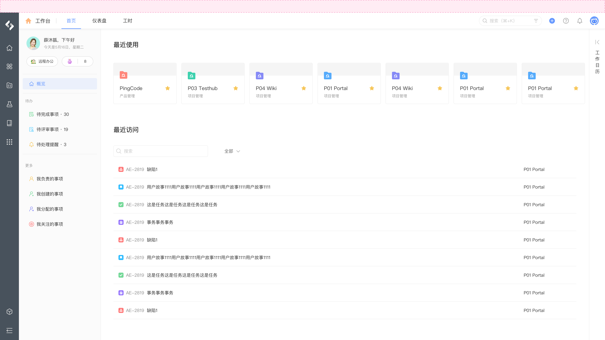

# 全局 - 顶部公告

全局顶部公告扩展模块，允许在系统顶部添加自定义公告：



## 配置

配置结构：

```yaml
extensions []
├─ key (string) [Mandatory]
├─ target (string) [Mandatory]
├─ resource (string) [Mandatory]
├─ resolver {} [Mandatory]
└─ dismissible (boolean) [Optional]
```

配置示例：

```yaml
extensions:
  - key: example-header-banner
    target: "pcm:global:header:banner"
    resource: main
    resolver:
      function: resolver
    dismissible: true
```

## 属性

<table style="width: 100%; table-layout: fixed"><colgroup><col style="width: 16.24%" /><col style="width: 16.95%" /><col style="width: 11.72%" /><col style="width: 55.09%" /></colgroup><thead><tr><th>属性</th><th>类型</th><th>必填</th><th>描述</th></tr></thead><tbody><tr><td><code>resource</code></td><td><code>string</code></td><td>Y</td><td>定义扩展模块所使用的资源，内容为 <code>resources</code> 节点的资源引用</td></tr><tr><td><code>resolver</code></td><td><code>{ function: string }</code>  或 <code>{ endpoint: string }</code></td><td>Y</td><td>定义扩展模块所使用的处理函数： - 指定后端处理函数时使用 <code>function</code> 属性 - 指定远程服务时使用 <code>endpoint</code> 属性</td></tr><tr><td><code>dismissible</code></td><td><code>boolean</code></td><td></td><td>定义扩展模块是否启用关闭，默认 <code>true</code></td></tr></tbody></table>

## 扩展数据

当前模块可访问的扩展数据：

<table style="width: 100%; table-layout: fixed"><colgroup><col style="width: 29.94%" /><col style="width: 70.06%" /></colgroup><thead><tr><th>数据</th><th>说明</th></tr></thead><tbody><tr><td>无</td><td></td></tr></tbody></table>

## 限制

每个扩展模块对应的数量限制：

<table style="width: 100%; table-layout: fixed"><colgroup><col style="width: 30.19%" /><col style="width: 10.56%" /><col style="width: 59.25%" /></colgroup><thead><tr><th>资源</th><th>限制</th><th>说明</th></tr></thead><tbody><tr><td>扩展模块数量</td><td><code>1</code></td><td>单个应用可以声明的当前扩展模块最大数量</td></tr></tbody></table>

## 桥接方法

当前扩展模块不支持以下桥接方法，详情请参考 [view](/reference/interface/bridge/view) 。

<table style="width: 100%; table-layout: fixed"><colgroup><col style="width: 49.44%" /><col style="width: 50.56%" /></colgroup><thead><tr><th>桥接方法</th><th>支持</th></tr></thead><tbody><tr><td><code>view.setWindowTitle</code></td><td>❌</td></tr><tr><td><code>view.refresh</code></td><td>❌</td></tr><tr><td><code>view.createHistory</code></td><td>❌</td></tr><tr><td><code>view.submit</code></td><td>❌</td></tr><tr><td><code>view.emitReadyEvent</code></td><td>❌</td></tr></tbody></table>
