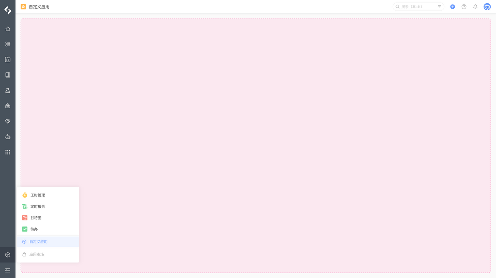
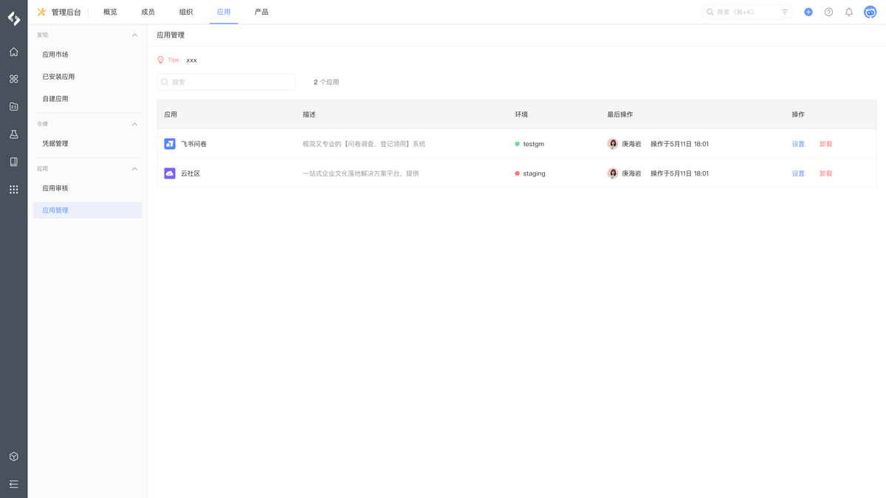
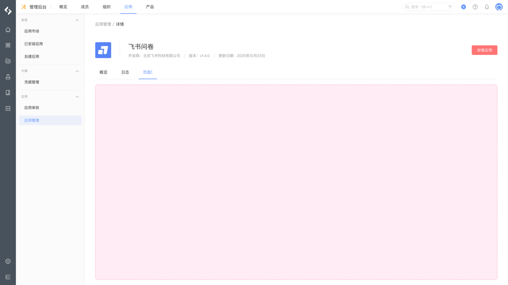
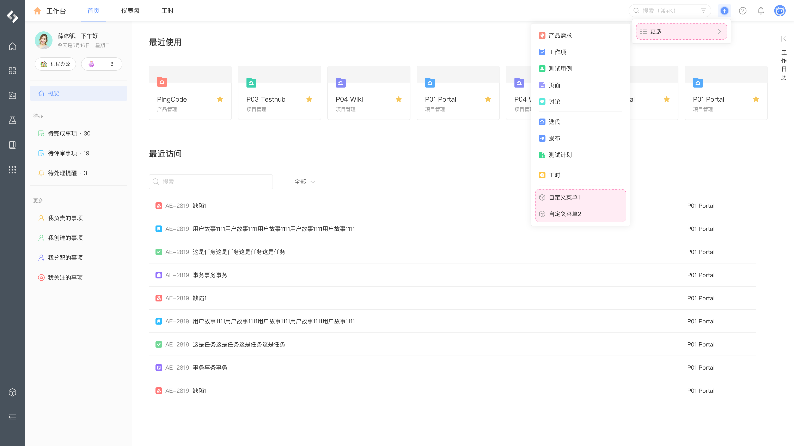
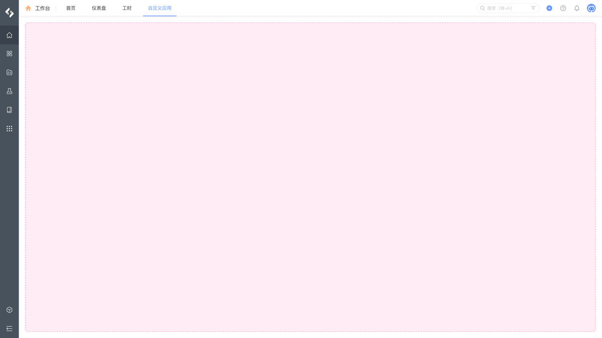
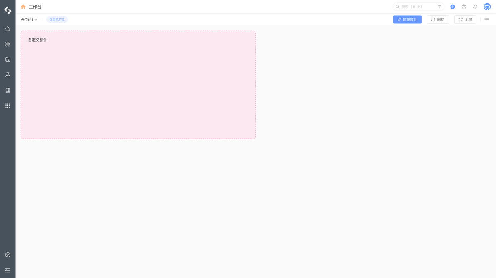

# 全局扩展

在 PingCode 全局扩展中，可以添加以下扩展模块来开发你的应用。

## 全局

<table style="width: 100%; table-layout: fixed"><colgroup><col style="width: 30.37%" /><col style="width: 34.18%" /><col style="width: 35.45%" /></colgroup><thead><tr><th>模块</th><th>定义</th><th>示例</th></tr></thead><tbody><tr><td><a href="/reference/resource/extensions/global-header-banner">全局｜顶部公告</a></td><td><code>pcm:global:header:banner</code></td><td></td></tr><tr><td><a href="/reference/resource/extensions/global-app-hub">全局｜独立应用</a></td><td><code>pcm:global:app:hub</code></td><td></td></tr><tr><td><a href="/reference/resource/extensions/global-app-setting">全局｜应用设置</a></td><td><code>pcm:global:app:setting</code></td><td> </td></tr><tr><td><a href="/reference/resource/extensions/global-create-action">全局 ｜ 新建菜单</a></td><td><code>pcm:global:create:action</code></td><td></td></tr></tbody></table>

## 工作台

<table style="width: 100%; table-layout: fixed"><colgroup><col style="width: 30.37%" /><col style="width: 34.21%" /><col style="width: 35.42%" /></colgroup><thead><tr><th>模块</th><th>定义</th><th>示例</th></tr></thead><tbody><tr><td><a href="/reference/resource/extensions/global-workspace-page"> 工作台｜首页导航</a></td><td><code>pcm:global:workspace:page</code></td><td></td></tr><tr><td><a href="/reference/resource/extensions/global-dashboard-widget">工作台｜仪表盘部件</a></td><td><code>pcm:global:dashboard:widget</code></td><td></td></tr></tbody></table>

## 帐号

<table style="width: 100%; table-layout: fixed"><colgroup><col style="width: 30.37%" /><col style="width: 34.18%" /><col style="width: 35.45%" /></colgroup><thead><tr><th>模块</th><th>定义</th><th>示例</th></tr></thead><tbody><tr><td><a href="/reference/resource/extensions/global-personal-setting"> 帐号｜个人设置</a></td><td><code>pcm:global:personal:setting</code></td><td></td></tr></tbody></table>
