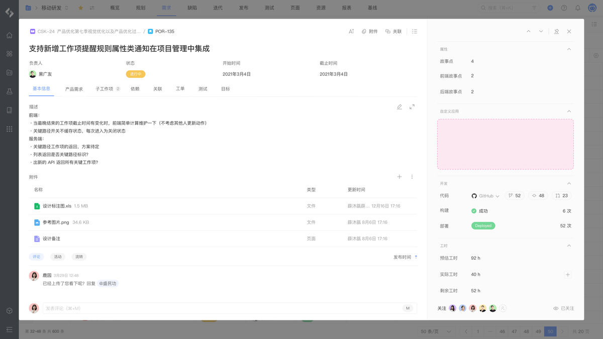

# 工作项 - 详情上下文

工作项详情页上下文扩展模块，允许在工作项详情页右侧增加扩展模块：



## 配置

配置结构：

```yaml
extensions []
├─ key (string) [Mandatory]
├─ target (string) [Mandatory]
├─ title (string | i18n) [Mandatory]
├─ viewport {} [Optional]
│  └─ size (string) [Optional]
├─ resource (string) [Mandatory]
└─ resolver {} [Mandatory]
```

配置示例：

```yaml
extensions:
  - key: example-workitem-context
    target: "pcm:pjm:workitem:context"
    title: Group title
    viewport: 
      size: medium
    resource: main
    resolver:
      function: resolver
```

## 属性

<table style="width: 100%; table-layout: fixed"><colgroup><col style="width: 16.24%" /><col style="width: 16.95%" /><col style="width: 11.72%" /><col style="width: 55.09%" /></colgroup><thead><tr><th>属性</th><th>类型</th><th>必填</th><th>描述</th></tr></thead><tbody><tr><td><code>title</code></td><td><code>string ｜ i18n</code></td><td>Y</td><td>定义扩展模块标题，显示在工作项详情页右侧属性面板中</td></tr><tr><td><code>viewport</code></td><td><code>object</code></td><td></td><td>定义扩展模块的尺寸</td></tr><tr><td><code>viewport·size</code></td><td><code>string</code></td><td></td><td>定义扩展模块的高度，默认高度自适应，可选 <code>small</code> , <code>medium</code> , <code>large</code> , <code>xlarge</code> , <code>max</code></td></tr><tr><td><code>resource</code></td><td><code>string</code></td><td>Y</td><td>定义扩展模块所使用的资源，内容为 <code>resources</code> 节点的资源引用</td></tr><tr><td><code>resolver</code></td><td><code>{ function: string }</code>  或 <code>{ endpoint: string }</code></td><td>Y</td><td>定义扩展模块所使用的处理函数： - 指定后端处理函数时使用 <code>function</code> 属性 - 指定远程服务时使用 <code>endpoint</code> 属性</td></tr></tbody></table>

## 扩展数据

当前模块可访问的扩展数据：

<table style="width: 100%; table-layout: fixed"><colgroup><col style="width: 27.26%" /><col style="width: 72.74%" /></colgroup><thead><tr><th>数据</th><th>说明</th></tr></thead><tbody><tr><td><code>project</code></td><td>项目数据 <a href="/reference/resource/context/project">project</a></td></tr><tr><td><code>workitem</code></td><td>工作项数据 <a href="/reference/resource/context/workitem">workitem</a></td></tr></tbody></table>

## 限制

每个扩展模块对应的数量限制：

<table style="width: 100%; table-layout: fixed"><colgroup><col style="width: 27.12%" /><col style="width: 20.06%" /><col style="width: 52.82%" /></colgroup><thead><tr><th>资源</th><th>限制</th><th>说明</th></tr></thead><tbody><tr><td>扩展模块数量</td><td><code>8</code></td><td>单个应用可以声明的当前扩展模块最大数量</td></tr></tbody></table>

## 桥接方法

当前扩展模块不支持以下桥接方法，详情请参考 [view](/reference/interface/bridge/view) 。

<table style="width: 100%; table-layout: fixed"><colgroup><col style="width: 49.44%" /><col style="width: 50.56%" /></colgroup><thead><tr><th>桥接方法</th><th>支持</th></tr></thead><tbody><tr><td><code>view.setWindowTitle</code></td><td>❌</td></tr><tr><td><code>view.createHistory</code></td><td>❌</td></tr><tr><td><code>view.submit</code></td><td>❌</td></tr></tbody></table>
