# 项目管理

在 PingCode 项目管理中，可以添加以下扩展模块来开发你的应用。

## 项目

<table style="width: 100%; table-layout: fixed"><colgroup><col style="width: 26.69%" /><col style="width: 37.85%" /><col style="width: 35.46%" /></colgroup><thead><tr><th>模块</th><th>定义</th><th>示例</th></tr></thead><tbody><tr><td><a href="/reference/resource/extensions/pjm-project-hub">项目 - 首页导航</a></td><td><code>pcm:pjm:project:hub</code></td><td>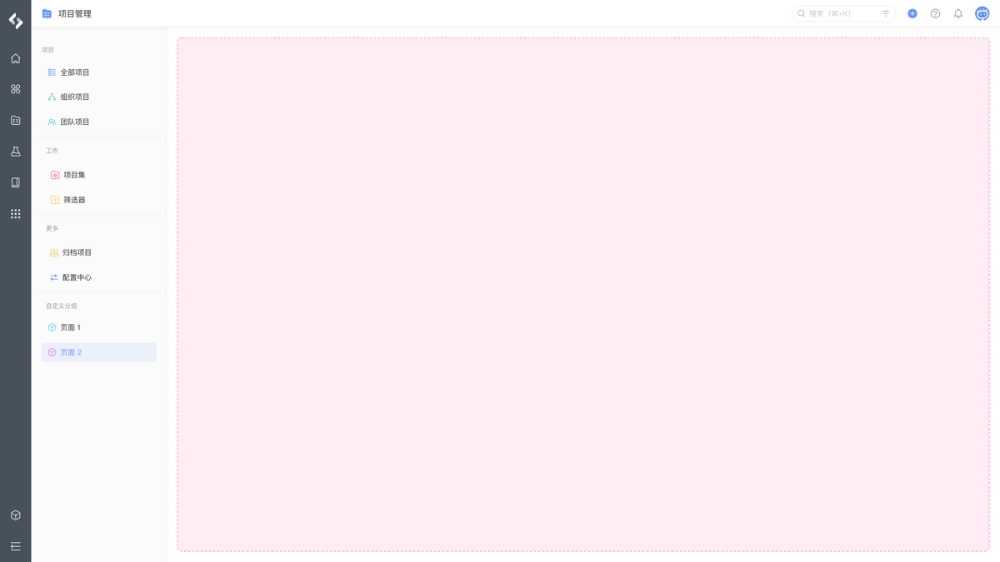</td></tr><tr><td><a href="/reference/resource/extensions/pjm-project-page">项目 - 组件页面</a></td><td><code>pcm:pjm:project:page</code></td><td>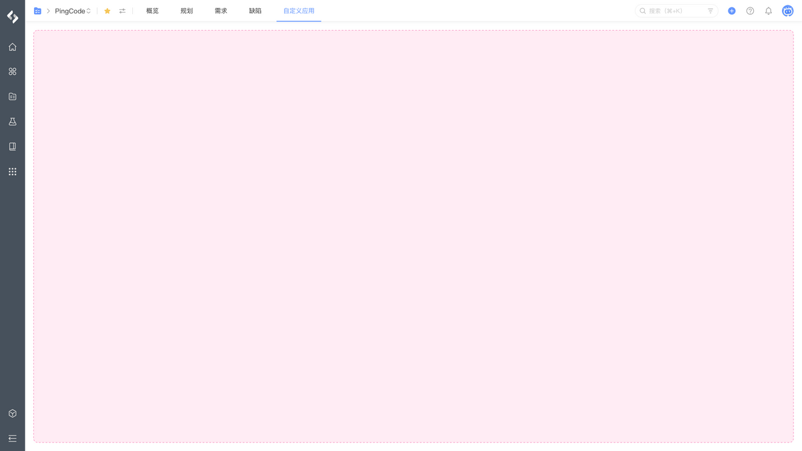</td></tr><tr><td><a href="/reference/resource/extensions/pjm-project-setting">项目 - 设置页面</a></td><td><code>pcm:pjm:project:setting</code></td><td>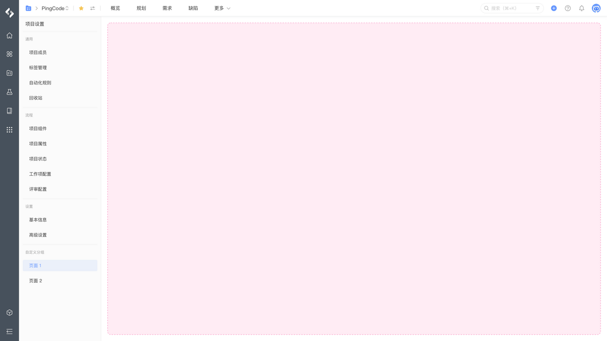</td></tr><tr><td><a href="/reference/resource/extensions/pjm-project-background">项目 - 首页后台脚本</a></td><td><code>pcm:pjm:project:background</code></td><td></td></tr></tbody></table>

## 工作项

<table style="width: 100%; table-layout: fixed"><colgroup><col style="width: 26.69%" /><col style="width: 37.85%" /><col style="width: 35.46%" /></colgroup><thead><tr><th>模块</th><th>定义</th><th>示例</th></tr></thead><tbody><tr><td><a href="/reference/resource/extensions/pjm-workitem-page">工作项 - 详情导航</a></td><td><code>pcm:pjm:workitem:area</code></td><td>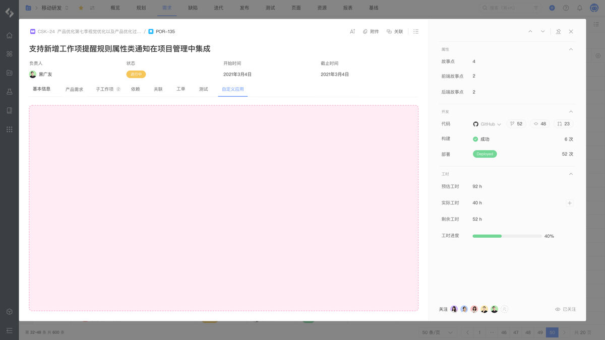</td></tr><tr><td><a href="/reference/resource/extensions/pjm-workitem-panel">工作项 - 详情面板</a></td><td><code>pcm:pjm:workitem:panel</code></td><td>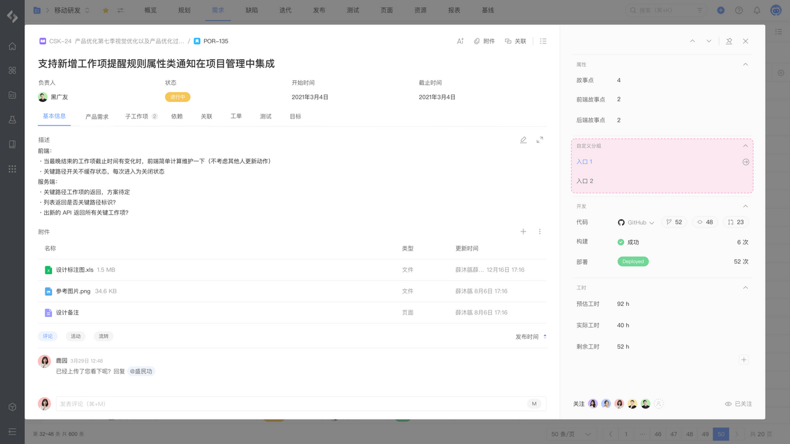</td></tr><tr><td><a href="/reference/resource/extensions/pjm-workitem-context">工作项 - 详情上下文</a></td><td><code>pcm:pjm:workitem:context</code></td><td></td></tr><tr><td><a href="/reference/resource/extensions/pjm-workitem-action">工作项 - 详情菜单</a></td><td><code>pcm:pjm:workitem:action</code></td><td>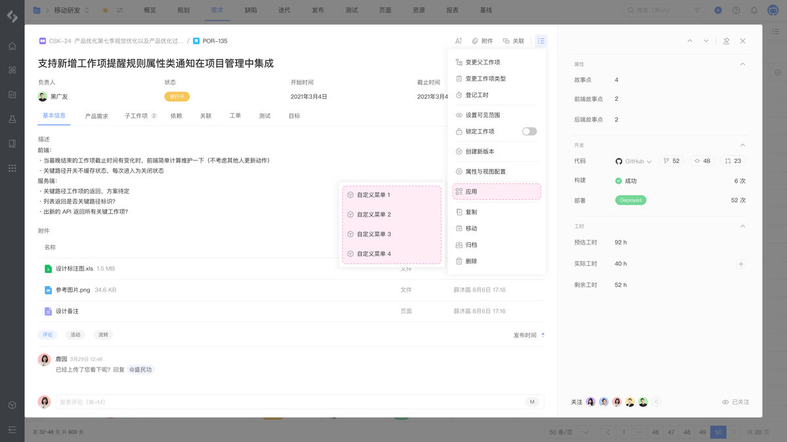</td></tr><tr><td><a href="/reference/resource/extensions/pjm-workitem-background">工作项 - 详情后台脚本</a></td><td><code>pcm:pjm:workitem:background</code></td><td></td></tr></tbody></table>

## 迭代

<table style="width: 100%; table-layout: fixed"><colgroup><col style="width: 26.98%" /><col style="width: 37.43%" /><col style="width: 35.59%" /></colgroup><thead><tr><th>模块</th><th>定义</th><th>示例</th></tr></thead><tbody><tr><td><a href="/reference/resource/extensions/pjm-sprint-page">迭代 - 详情导航</a></td><td><code>pcm:pjm:sprint:page</code></td><td>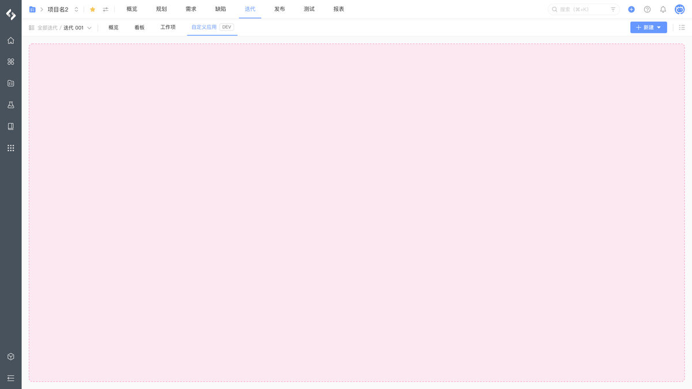</td></tr><tr><td><a href="/reference/resource/extensions/pjm-sprint-action">迭代 - 详情菜单</a></td><td><code>pcm:pjm:sprint:action</code></td><td>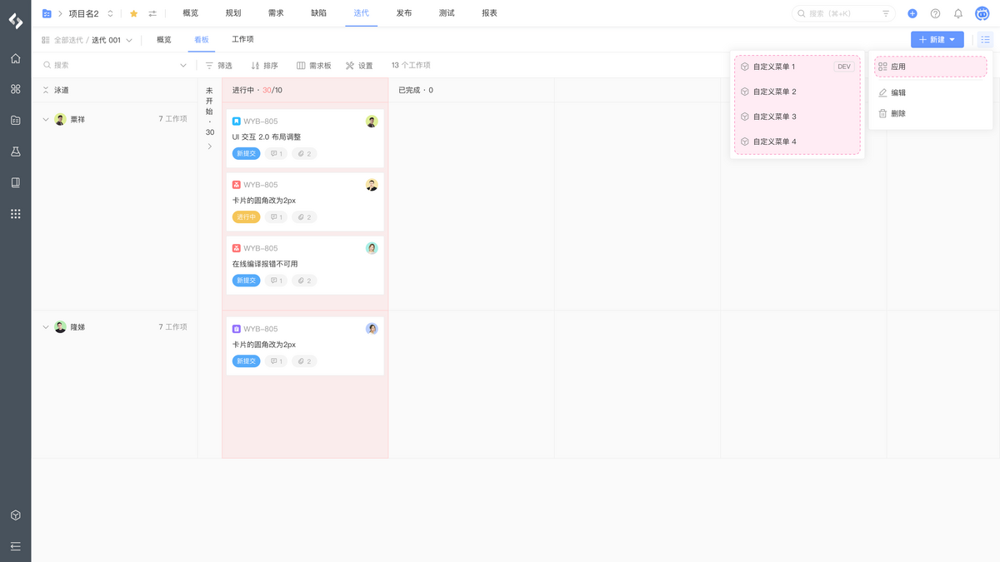</td></tr></tbody></table>

## 发布

<table style="width: 100%; table-layout: fixed"><colgroup><col style="width: 26.98%" /><col style="width: 37.43%" /><col style="width: 35.59%" /></colgroup><thead><tr><th>模块</th><th>定义</th><th>示例</th></tr></thead><tbody><tr><td><a href="/reference/resource/extensions/pjm-release-page">发布 - 详情导航</a></td><td><code>pcm:pjm:release:page</code></td><td>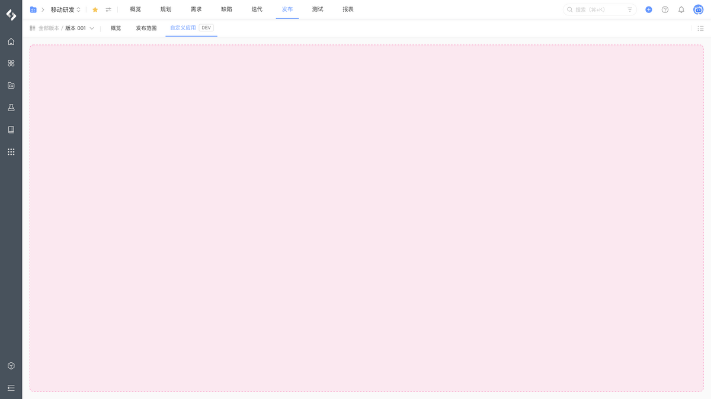</td></tr><tr><td><a href="/reference/resource/extensions/pjm-release-action">发布 - 详情菜单</a></td><td><code>pcm:pjm:release:action</code></td><td>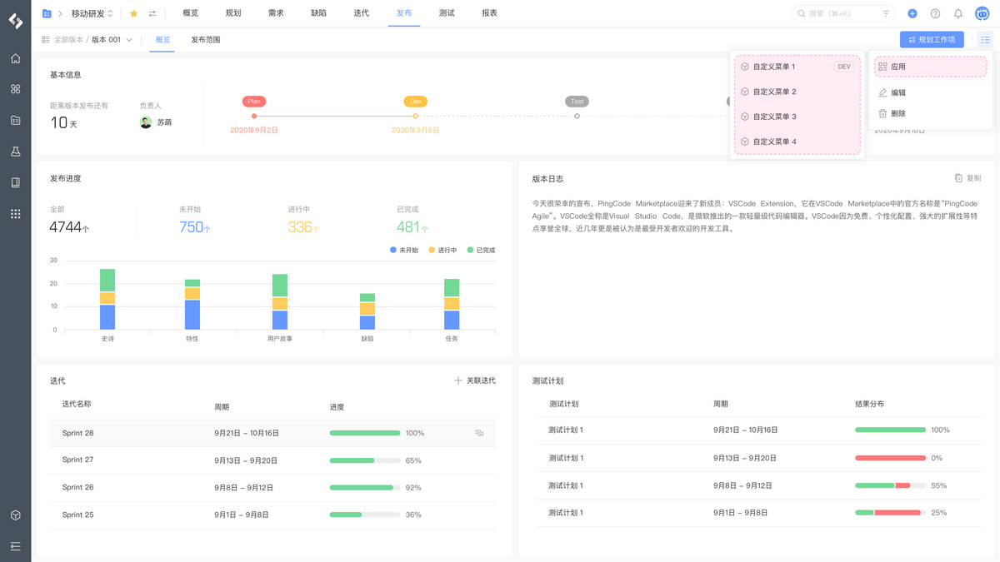</td></tr></tbody></table>

## 基线

<table style="width: 100%; table-layout: fixed"><colgroup><col style="width: 26.98%" /><col style="width: 37.43%" /><col style="width: 35.59%" /></colgroup><thead><tr><th>模块</th><th>定义</th><th>示例</th></tr></thead><tbody><tr><td><a href="/reference/resource/extensions/pjm-baseline-page">基线 - 详情导航</a></td><td><code>pcm:pjm:baseline:page</code></td><td>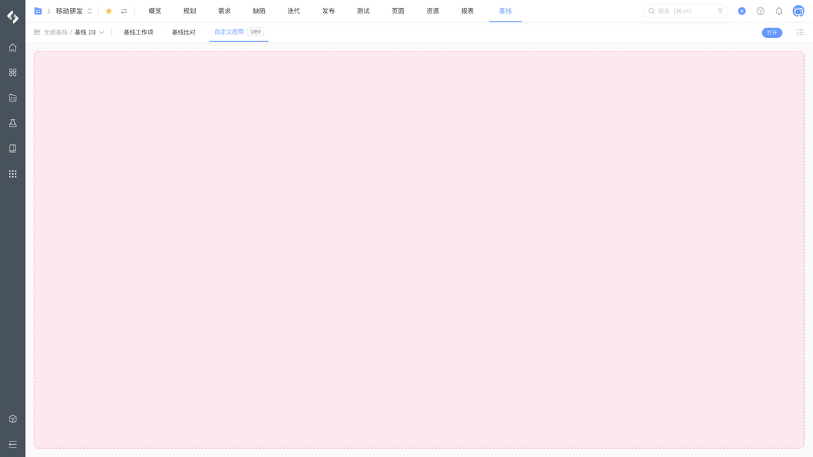</td></tr><tr><td><a href="/reference/resource/extensions/pjm-baseline-action">基线 - 详情菜单</a></td><td><code>pcm:pjm:baseline:action</code></td><td>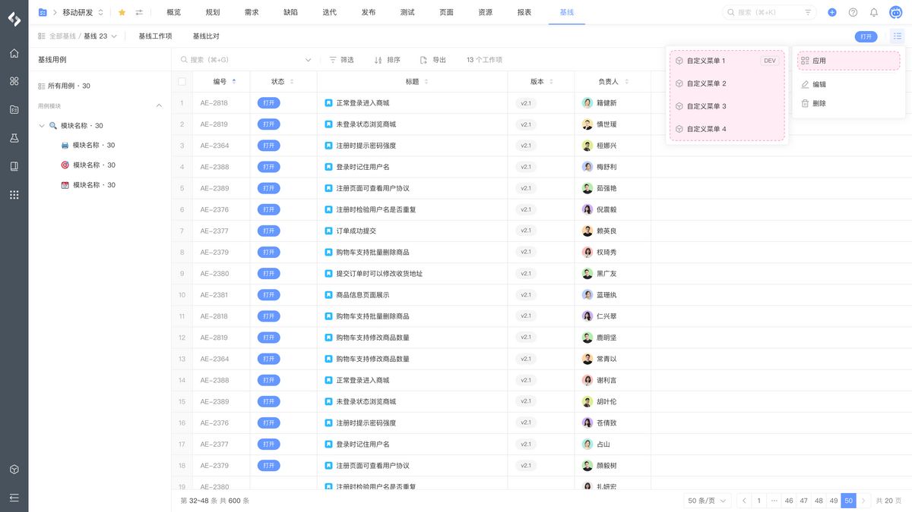</td></tr></tbody></table>
