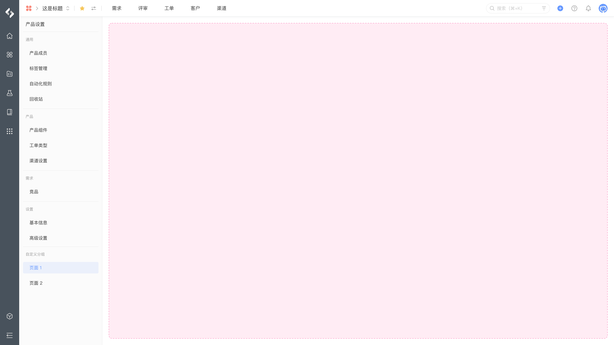

# 产品 - 产品设置

产品设置页面扩展模块，允许在产品设置中添加自定义扩展页面，扩展页面支持自定义分组名称，该页面的访问地址为：

`/ship/products/{identifier}/settings/apps/{appId}/{envId}/{route}`



## 配置

配置结构：

```yaml
extensions []
├─ key (string) [Mandatory]
├─ target (string) [Mandatory]
├─ resolver {} [Mandatory]
├─ pages {} [Mandatory]
│  ├─ key (string) [Mandatory]
│  ├─ title (string | i18n) [Mandatory]
│  ├─ resource (string) [Mandatory]
│  └─ route (string) [Mandatory]
└─ section {} [Optional]
   ├─ header (string) [Mandatory]
   └─ enabled (boolean) [Optional]
```

配置示例：

```yaml
extensions:
  - key: example-product-setting
    target: "pcm:ship:product:setting"
    resolver:
      function: resolver
    pages:
      - key: example-page
        title: Page title
        resource: main
        route: route-page
    section:
      header: Section title
      enabled: true
```

## 属性

配置属性：

<table style="width: 100%; table-layout: fixed"><colgroup><col style="width: 16.24%" /><col style="width: 16.95%" /><col style="width: 11.72%" /><col style="width: 55.09%" /></colgroup><thead><tr><th>属性</th><th>类型</th><th>必填</th><th>描述</th></tr></thead><tbody><tr><td><code>resolver</code></td><td><code>{ function: string }</code>  或 <code>{ endpoint: string }</code></td><td>Y</td><td>定义扩展模块所使用的处理函数： - 指定后端处理函数时使用 <code>function</code> 属性 - 指定远程服务时使用 <code>endpoint</code> 属性</td></tr><tr><td><code>pages</code></td><td><code>array[]</code></td><td>Y</td><td>定义扩展模块所包括的页面</td></tr><tr><td><code>pages·key</code></td><td><code>string</code></td><td>Y</td><td>定义扩展模块所包括的页面的唯一标识</td></tr><tr><td><code>pages·title</code></td><td><code>string ｜ i18n</code></td><td>Y</td><td>定义扩展模块所包括的页面的标题</td></tr><tr><td><code>pages·resource</code></td><td><code>string</code></td><td>Y</td><td>定义扩展模块所包括的页面所使用的资源，内容为 <code>resources</code> 节点的资源引用</td></tr><tr><td><code>pages·route</code></td><td><code>string</code></td><td>Y</td><td>定义扩展模块具体页面的路由</td></tr><tr><td><code>section</code></td><td><code>section[]</code></td><td></td><td>定义扩展模块分组</td></tr><tr><td><code>section·header</code></td><td><code>string</code></td><td></td><td>定义扩展模块分组名称，默认名称 <code>应用</code></td></tr><tr><td><code>section·enabled</code></td><td><code>boolean</code></td><td></td><td>定义扩展模块分组是否展示，默认 <code>true</code></td></tr></tbody></table>

## 扩展数据

当前模块可访问的扩展数据：

<table style="width: 100%; table-layout: fixed"><colgroup><col style="width: 29.94%" /><col style="width: 70.06%" /></colgroup><thead><tr><th>数据</th><th>说明</th></tr></thead><tbody><tr><td><code>product</code></td><td>产品数据 <a href="/reference/resource/context/product">product</a></td></tr></tbody></table>

## 限制

每个扩展模块对应的数量限制：

<table style="width: 100%; table-layout: fixed"><colgroup><col style="width: 30.08%" /><col style="width: 24.29%" /><col style="width: 45.63%" /></colgroup><thead><tr><th>限制项</th><th>限制</th><th>说明</th></tr></thead><tbody><tr><td>扩展模块数量</td><td><code>1</code></td><td>单个应用可以声明的当前扩展模块最大数量</td></tr><tr><td>页面数量</td><td><code>8</code></td><td>单个当前模块下可以声明的页面数量</td></tr></tbody></table>

## 桥接方法

当前扩展模块不支持以下桥接方法，详情请参考 [view](/reference/interface/bridge/view) 。

<table style="width: 100%; table-layout: fixed"><colgroup><col style="width: 49.44%" /><col style="width: 50.56%" /></colgroup><thead><tr><th>桥接方法</th><th>支持</th></tr></thead><tbody><tr><td><code>view.refresh</code></td><td>❌</td></tr><tr><td><code>view.submit</code></td><td>❌</td></tr><tr><td><code>view.emitReadyEvent</code></td><td>❌</td></tr></tbody></table>
