# 产品管理

在 PingCode 产品管理中，可以添加以下扩展模块来开发你的应用。

## 产品

<table style="width: 100%; table-layout: fixed"><colgroup><col style="width: 32.34%" /><col style="width: 39.83%" /><col style="width: 27.83%" /></colgroup><thead><tr><th>模块</th><th>定义</th><th>示例</th></tr></thead><tbody><tr><td><a href="/reference/resource/extensions/ship-product-hub">产品 - 首页导航</a></td><td><code>pcm:ship:product:hub</code></td><td>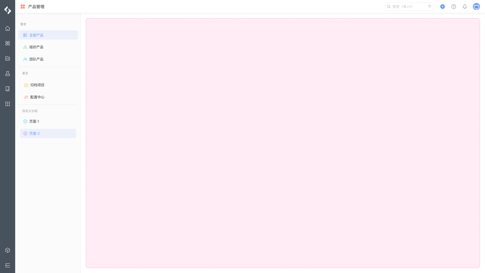</td></tr><tr><td><a href="/reference/resource/extensions/ship-product-page">产品 - 组件页面</a></td><td><code>pcm:ship:product:page</code></td><td>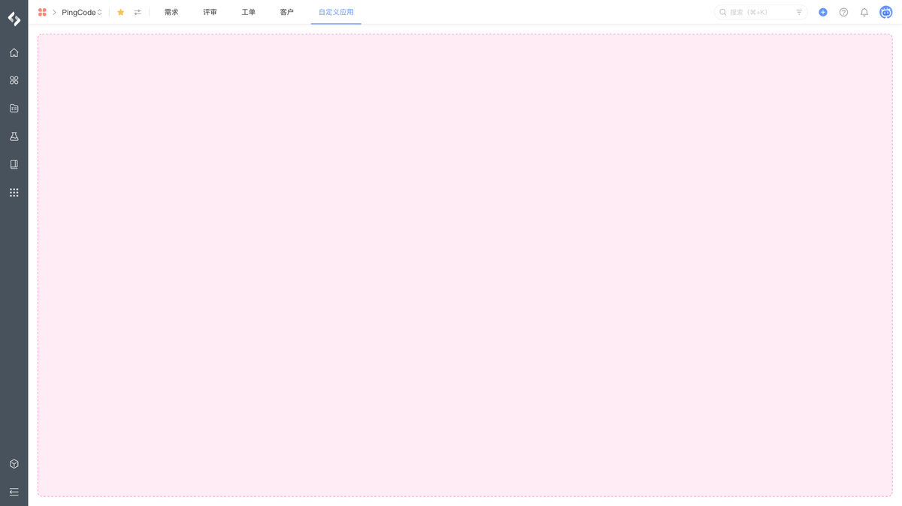</td></tr><tr><td><a href="/reference/resource/extensions/ship-product-setting">产品 - 产品设置</a></td><td><code>pcm:ship:product:setting</code></td><td>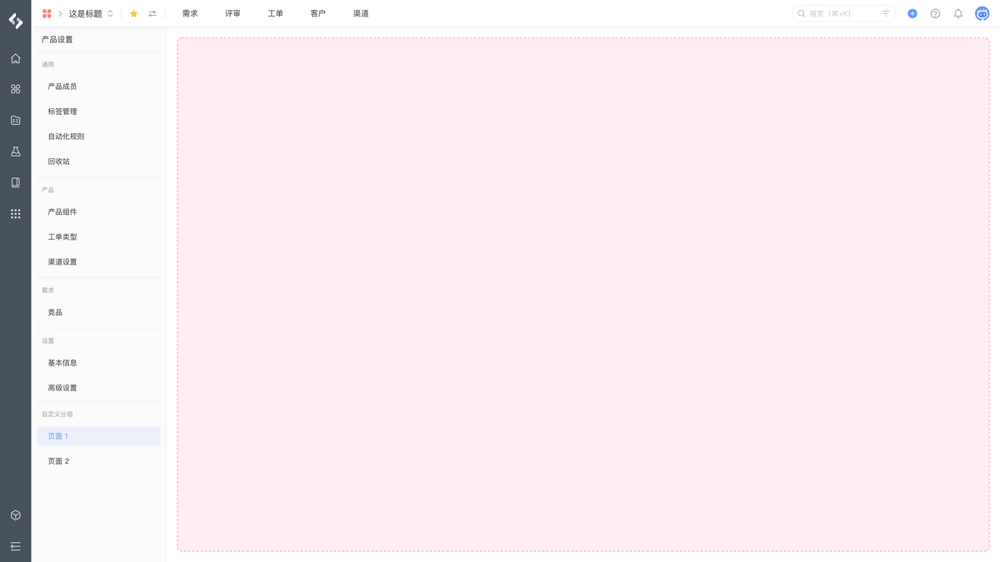</td></tr><tr><td><a href="/reference/resource/extensions/ship-product-background">产品 - 首页后台脚本</a></td><td><code>pcm:ship:product:background</code></td><td></td></tr></tbody></table>

## 需求

<table style="width: 100%; table-layout: fixed"><colgroup><col style="width: 32.2%" /><col style="width: 39.97%" /><col style="width: 27.83%" /></colgroup><thead><tr><th>模块</th><th>定义</th><th>示例</th></tr></thead><tbody><tr><td><a href="/reference/resource/extensions/ship-idea-area">需求 - 详情导航</a></td><td><code>pcm:ship:idea:area</code></td><td>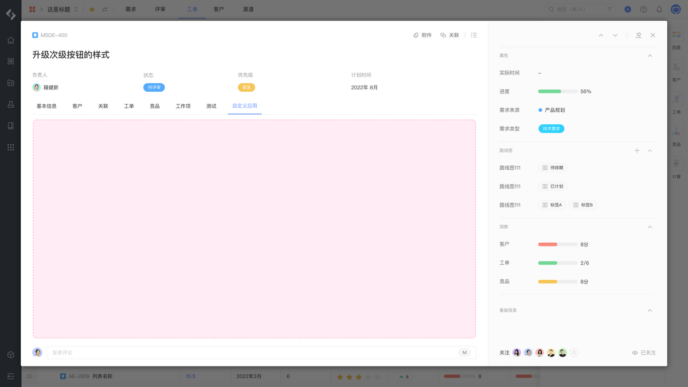</td></tr><tr><td><a href="/reference/resource/extensions/ship-idea-panel">需求 - 详情面板</a></td><td><code>pcm:ship:idea:panel</code></td><td>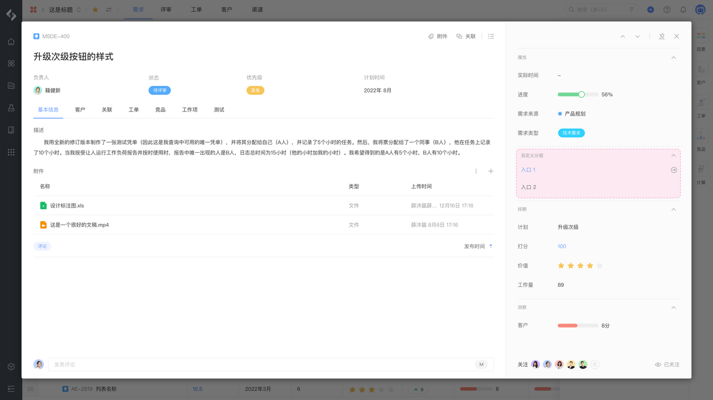</td></tr><tr><td><a href="/reference/resource/extensions/ship-idea-context">需求 - 详情上下文</a></td><td><code>pcm:ship:idea:context</code></td><td>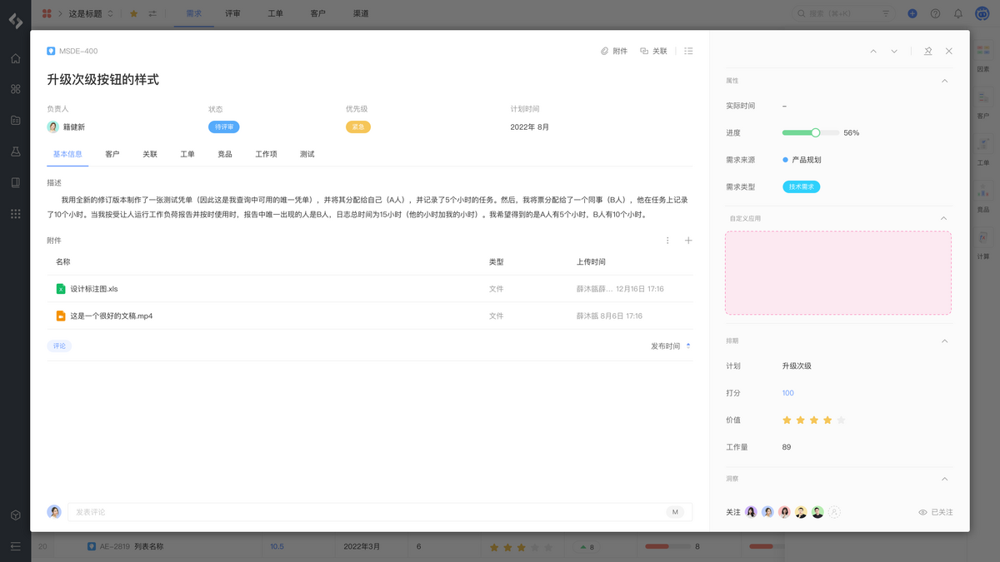</td></tr><tr><td><a href="/reference/resource/extensions/ship-idea-action">需求 - 详情菜单</a></td><td><code>pcm:ship:idea:action</code></td><td>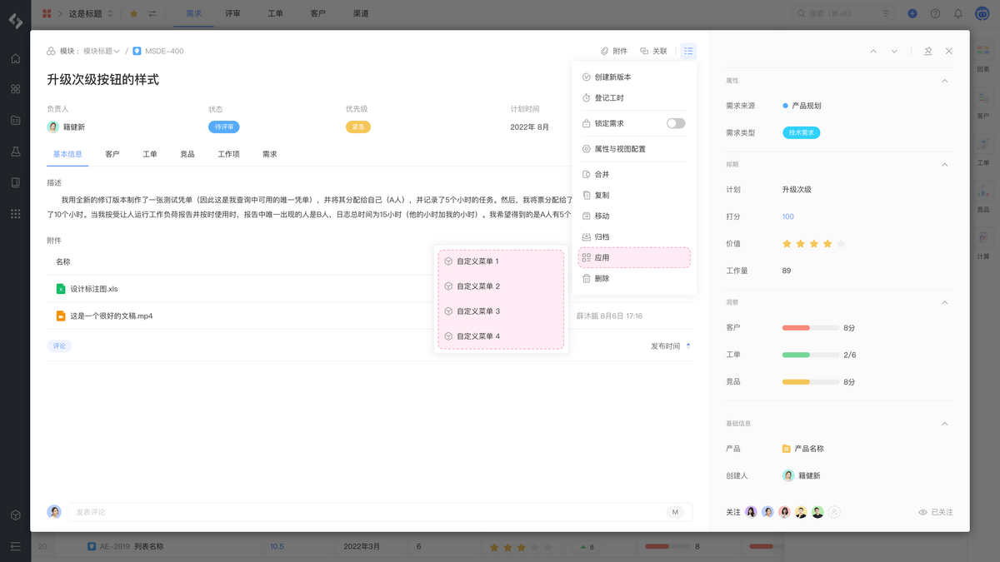</td></tr><tr><td><a href="/reference/resource/extensions/ship-idea-background">需求 - 详情后台脚本</a></td><td><code>pcm:ship:idea:background</code></td><td></td></tr></tbody></table>

## 工单

<table style="width: 100%; table-layout: fixed"><colgroup><col style="width: 31.64%" /><col style="width: 40.4%" /><col style="width: 27.96%" /></colgroup><thead><tr><th>模块</th><th>定义</th><th>示例</th></tr></thead><tbody><tr><td><a href="/reference/resource/extensions/ship-ticket-area">工单 - 详情导航</a></td><td><code>pcm:ship:ticket:area</code></td><td>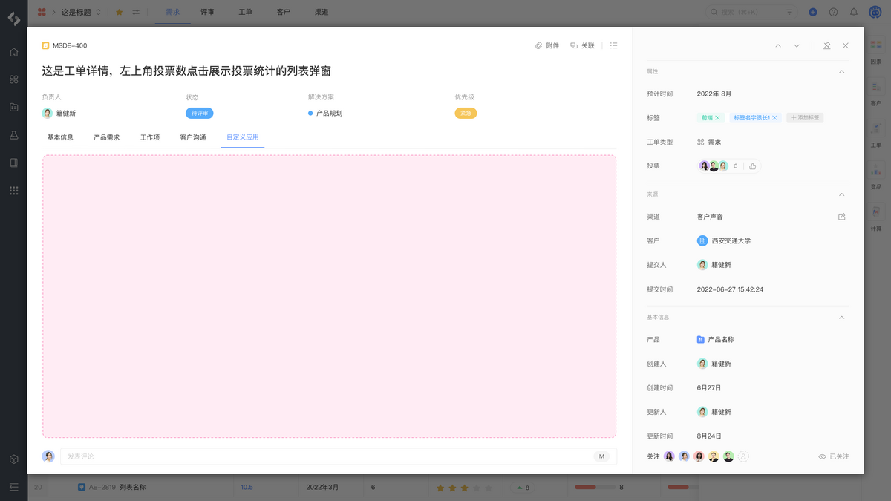</td></tr><tr><td><a href="/reference/resource/extensions/ship-ticket-panel">工单 - 详情面板</a></td><td><code>pcm:ship:ticket:panel</code></td><td>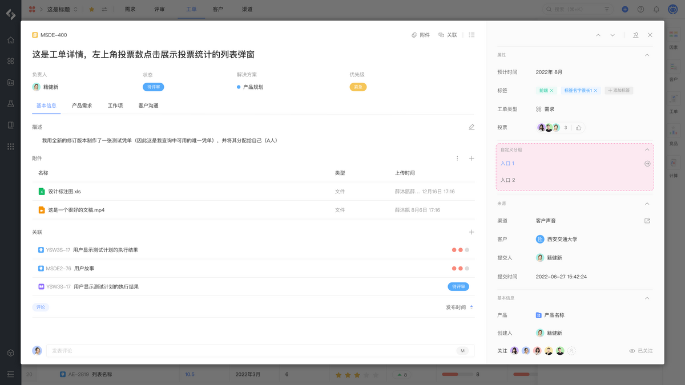</td></tr><tr><td><a href="/reference/resource/extensions/ship-ticket-context">工单 - 详情上下文</a></td><td><code>pcm:ship:ticket:context</code></td><td>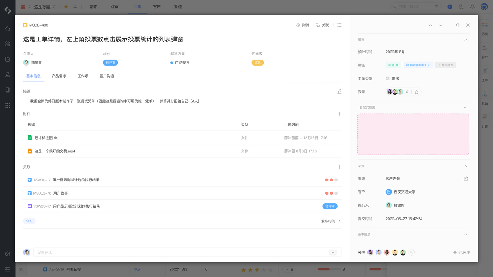</td></tr><tr><td><a href="/reference/resource/extensions/ship-ticket-action">工单 - 详情菜单</a></td><td><code>pcm:ship:ticket:action</code></td><td>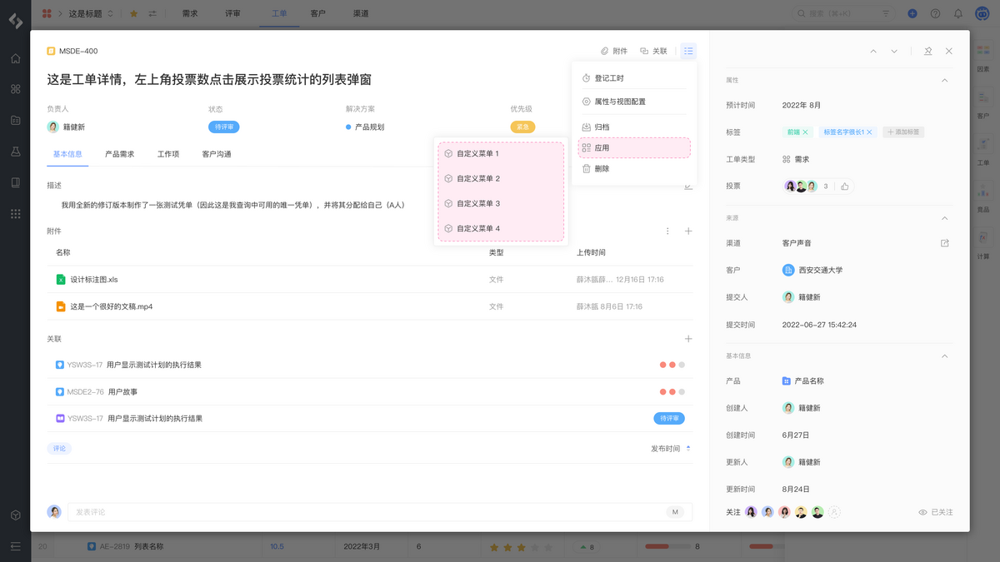</td></tr><tr><td><a href="/reference/resource/extensions/ship-ticket-background">工单 - 详情后台脚本</a></td><td><code>pcm:ship:ticket:background</code></td><td></td></tr></tbody></table>

## 计划

<table style="width: 100%; table-layout: fixed"><colgroup><col style="width: 32.06%" /><col style="width: 40.4%" /><col style="width: 27.54%" /></colgroup><thead><tr><th>模块</th><th>定义</th><th>示例</th></tr></thead><tbody><tr><td><a href="/reference/resource/extensions/ship-plan-page">计划 - 详情导航</a></td><td><code>pcm:ship:plan:page</code></td><td>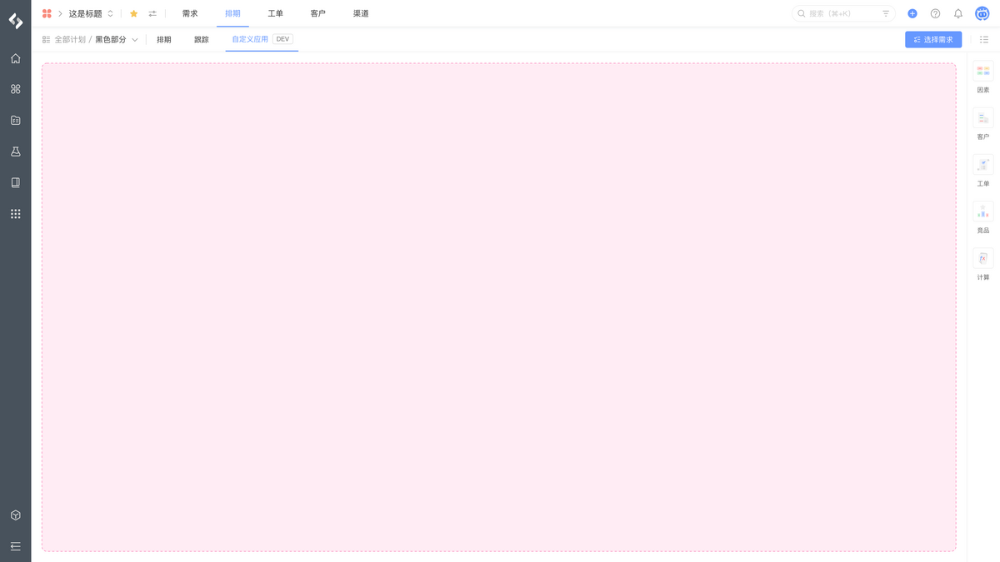</td></tr><tr><td><a href="/reference/resource/extensions/ship-plan-action">计划 - 详情菜单</a></td><td><code>pcm:ship:plan:action</code></td><td>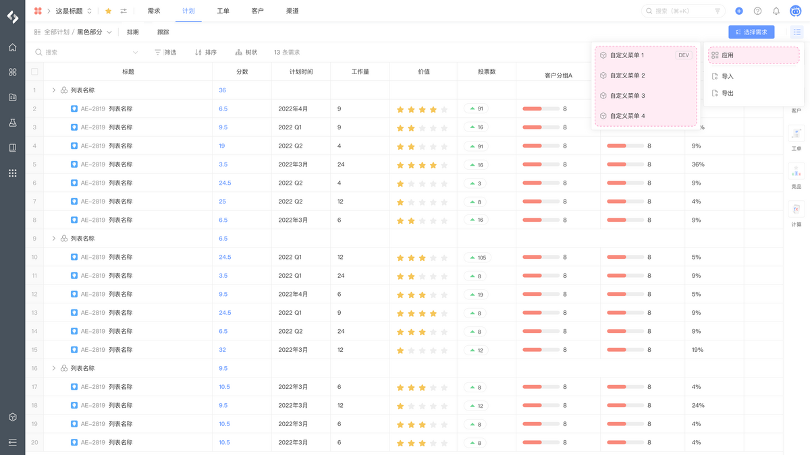</td></tr></tbody></table>

## 基线

<table style="width: 100%; table-layout: fixed"><colgroup><col style="width: 32.06%" /><col style="width: 40.25%" /><col style="width: 27.69%" /></colgroup><thead><tr><th>模块</th><th>定义</th><th>示例</th></tr></thead><tbody><tr><td><a href="/reference/resource/extensions/ship-baseline-page">基线 - 详情导航</a></td><td><code>pcm:ship:baseline:page</code></td><td>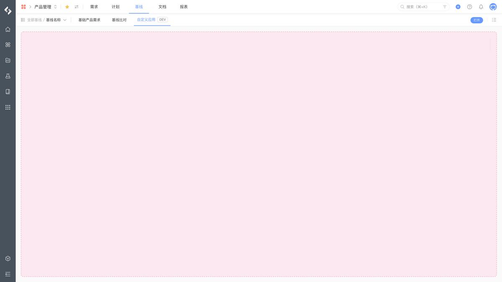</td></tr><tr><td><a href="/reference/resource/extensions/ship-baseline-action">基线 - 详情菜单</a></td><td><code>pcm:ship:baseline:action</code></td><td>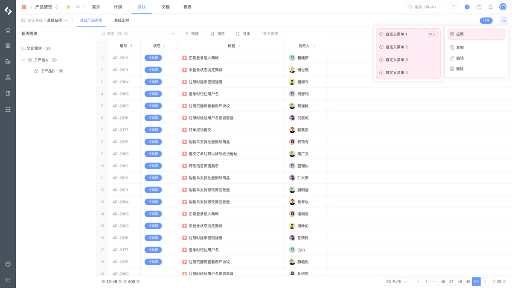</td></tr></tbody></table>
