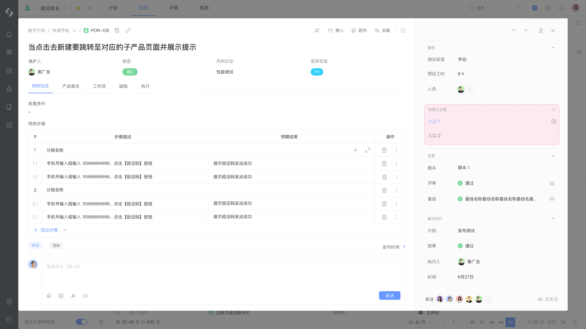
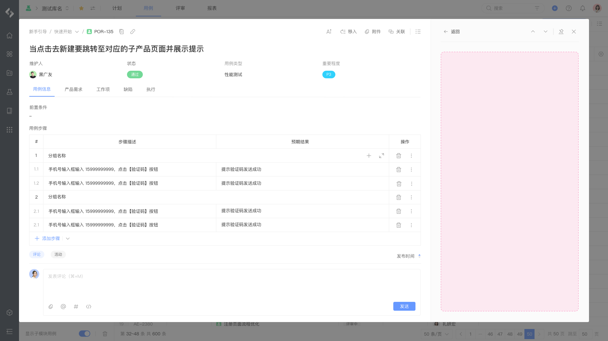

# 测试用例 - 详情面板

测试用例详情页扩展模块，允许在测试用例详情页右侧增加扩展模块，点击可进入二级页：





## 配置

配置结构：

```yaml
extensions []
├─ key (string) [Mandatory]
├─ target (string) [Mandatory]
├─ resolver {} [Mandatory]
├─ entries [] [Mandatory]
│  ├─ key (string) [Mandatory]
│  ├─ title (string | i18n) [Mandatory]
│  ├─ panel [] [Mandatory]
│  │  ├─ resource (string) [Mandatory]
└─ section {} [Optional]
   ├─ header (string) [Mandatory]
   └─ enabled (boolean) [Optional]
```

配置示例：

```yaml
extensions:
  - key: example-testcase-panel
    target: "pcm:testhub:testcase:panel"
    resolver:
      function: resolver
    entries:
      - key: example-entry
        title: Entry title
        panel:
          resource: main
    section: 
      header: Section title
      enabled: true
```

## 属性

<table style="width: 100%; table-layout: fixed"><colgroup><col style="width: 16.24%" /><col style="width: 16.95%" /><col style="width: 11.72%" /><col style="width: 55.09%" /></colgroup><thead><tr><th>属性</th><th>类型</th><th>必填</th><th>描述</th></tr></thead><tbody><tr><td><code>resolver</code></td><td><code>{ function: string }</code>  或 <code>{ endpoint: string }</code></td><td>Y</td><td>定义扩展模块所使用的处理函数： - 指定后端处理函数时使用 <code>function</code> 属性 - 指定远程服务时使用 <code>endpoint</code> 属性</td></tr><tr><td><code>entries</code></td><td><code>array[]</code></td><td>Y</td><td>定义扩展模块所包括的入口</td></tr><tr><td><code>entries·key</code></td><td><code>string</code></td><td>Y</td><td>定义扩展模块所包括的入口的唯一标识</td></tr><tr><td><code>entries·title</code></td><td><code>string \| i18n</code></td><td>Y</td><td>定义扩展模块所包括的入口的标题</td></tr><tr><td><code>entries·panel</code></td><td><code>object</code></td><td>Y</td><td>定义扩展模块</td></tr><tr><td><code>entries·panel·resource</code></td><td><code>string</code></td><td>Y</td><td>定义扩展模块所包括的模块所使用的资源，内容为 <code>resources</code> 节点的资源引用</td></tr><tr><td><code>section</code></td><td><code>object</code></td><td></td><td>定义扩展模块分组</td></tr><tr><td><code>section·header</code></td><td><code>string</code></td><td></td><td>定义扩展模块分组名称，默认名称 <code>应用</code></td></tr><tr><td><code>section·enabled</code></td><td><code>boolean</code></td><td></td><td>定义扩展模块分组是否展示，默认 <code>true</code></td></tr></tbody></table>

## 扩展数据

当前模块可访问的扩展数据：

<table style="width: 100%; table-layout: fixed"><colgroup><col style="width: 27.12%" /><col style="width: 72.88%" /></colgroup><thead><tr><th>数据</th><th>说明</th></tr></thead><tbody><tr><td><code>library</code></td><td>测试库数据 <a href="/reference/resource/context/library">library</a></td></tr><tr><td><code>testcase</code></td><td>测试用例数据 <a href="/reference/resource/context/testcase">testcase</a></td></tr></tbody></table>

## 限制

每个扩展模块对应的数量限制：

<table style="width: 100%; table-layout: fixed"><colgroup><col style="width: 27.12%" /><col style="width: 20.06%" /><col style="width: 52.82%" /></colgroup><thead><tr><th>资源</th><th>限制</th><th>说明</th></tr></thead><tbody><tr><td>扩展模块数量</td><td><code>1</code></td><td>单个应用可以声明的当前扩展模块最大数量</td></tr><tr><td>入口数量</td><td><code>8</code></td><td>单个当前模块下可以声明的入口数量</td></tr></tbody></table>

## 桥接方法

当前扩展模块不支持以下桥接方法，详情请参考 [view](/reference/interface/bridge/view) 。

<table style="width: 100%; table-layout: fixed"><colgroup><col style="width: 49.44%" /><col style="width: 50.56%" /></colgroup><thead><tr><th>桥接方法</th><th>支持</th></tr></thead><tbody><tr><td><code>view.setWindowTitle</code></td><td>❌</td></tr><tr><td><code>view.createHistory</code></td><td>❌</td></tr><tr><td><code>view.submit</code></td><td>❌</td></tr></tbody></table>
