# 测试管理

在 PingCode 测试管理中，可以添加以下扩展模块来开发你的应用。

## 测试库

<table style="width: 100%; table-layout: fixed"><colgroup><col style="width: 26.69%" /><col style="width: 37.85%" /><col style="width: 35.46%" /></colgroup><thead><tr><th>模块</th><th>定义</th><th>示例</th></tr></thead><tbody><tr><td><a href="/reference/resource/extensions/testhub-library-hub">测试库 - 首页导航</a></td><td><code>pcm:testhub:library:hub</code></td><td>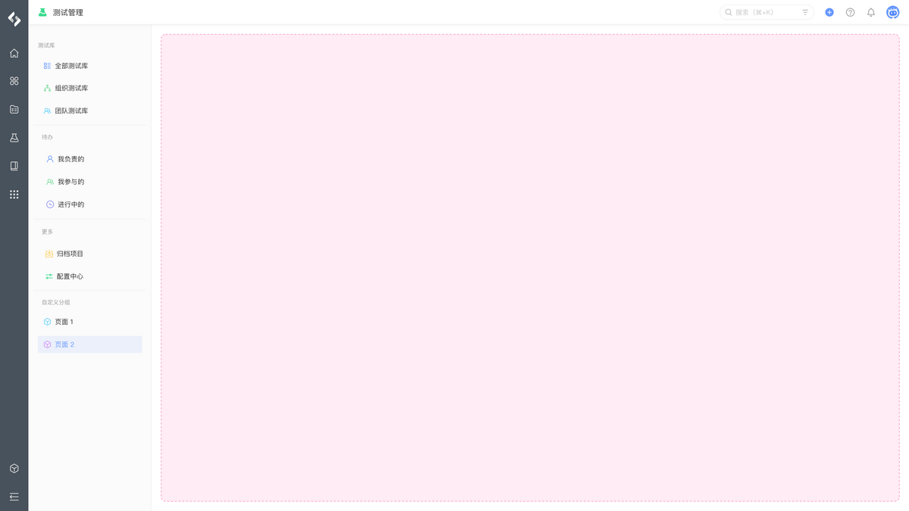</td></tr><tr><td><a href="/reference/resource/extensions/testhub-library-page">测试库 - 组件页面</a></td><td><code>pcm:testhub:library:page</code></td><td>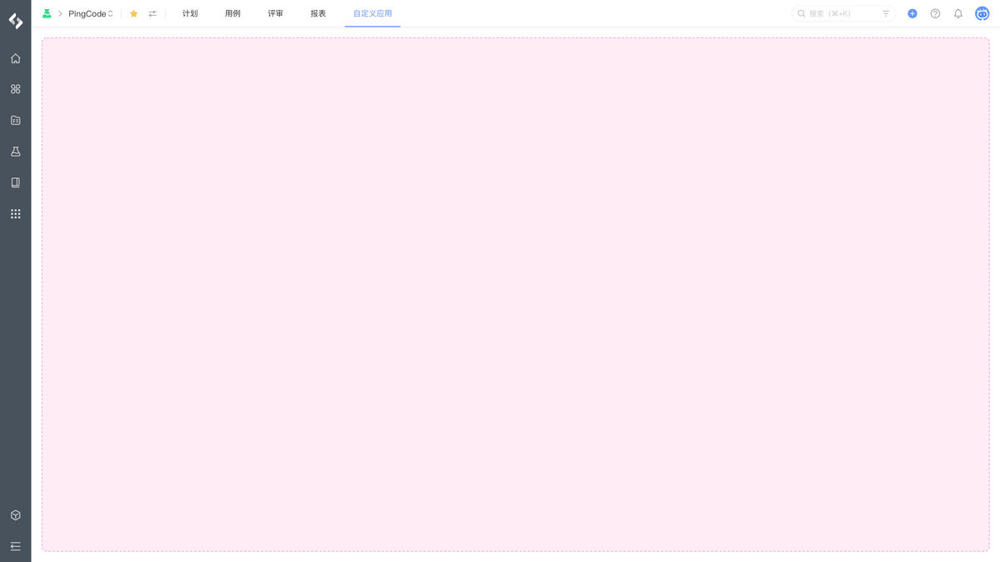</td></tr><tr><td><a href="/reference/resource/extensions/testhub-library-setting">测试库 - 设置页面</a></td><td><code>pcm:testhub:library:setting</code></td><td>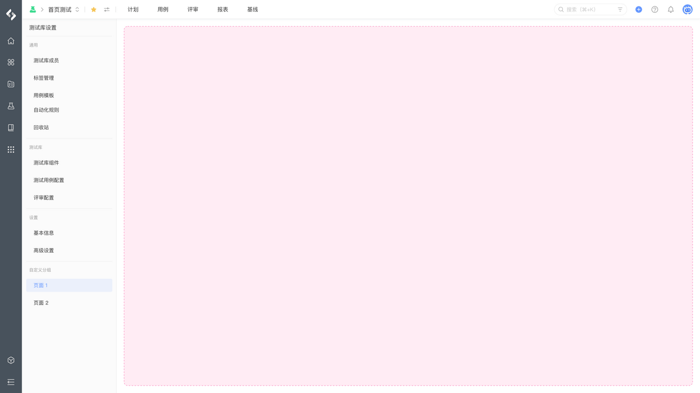</td></tr><tr><td><a href="/reference/resource/extensions/testhub-library-background">测试库 - 首页后台脚本</a></td><td><code>pcm:testhub:library:background</code></td><td></td></tr></tbody></table>

## 测试用例

<table style="width: 100%; table-layout: fixed"><colgroup><col style="width: 26.69%" /><col style="width: 37.85%" /><col style="width: 35.46%" /></colgroup><thead><tr><th>模块</th><th>定义</th><th>示例</th></tr></thead><tbody><tr><td><a href="/reference/resource/extensions/testhub-testcase-page">测试用例 - 详情导航</a></td><td><code>pcm:testhub:testcase:area</code></td><td>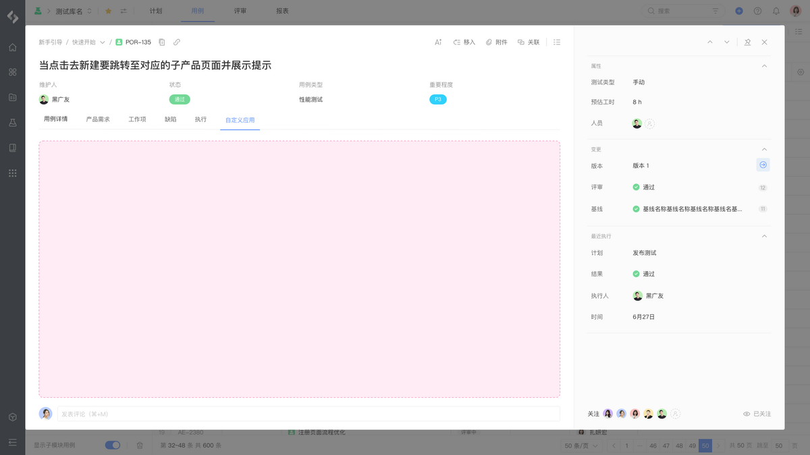</td></tr><tr><td><a href="/reference/resource/extensions/testhub-testcase-panel">测试用例 - 详情面板</a></td><td><code>pcm:testhub:testcase:panel</code></td><td>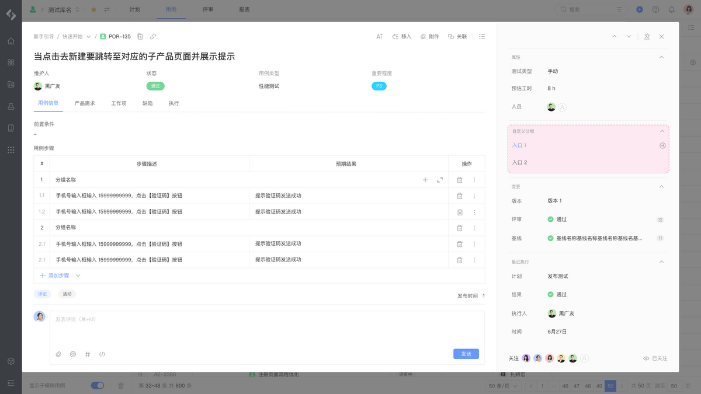</td></tr><tr><td><a href="/reference/resource/extensions/testhub-testcase-context">测试用例 - 详情上下文</a></td><td><code>pcm:testhub:testcase:context</code></td><td>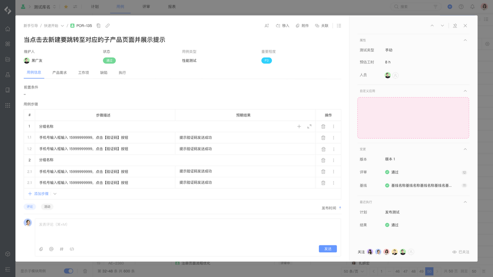</td></tr><tr><td><a href="/reference/resource/extensions/testhub-testcase-action">测试用例 - 详情菜单</a></td><td><code>pcm:testhub:testcase:action</code></td><td>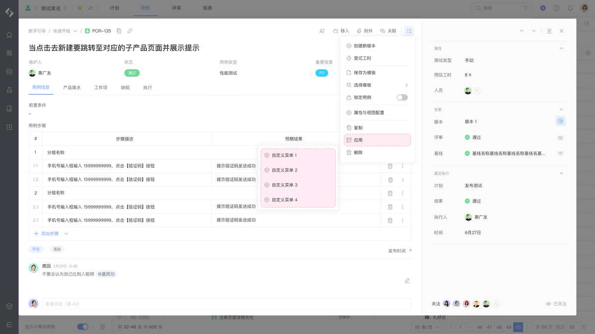</td></tr><tr><td><a href="/reference/resource/extensions/testhub-testcase-background">测试用例 - 详情后台脚本</a></td><td><code>pcm:testhub:testcase:background</code></td><td></td></tr></tbody></table>

## 测试计划

<table style="width: 100%; table-layout: fixed"><colgroup><col style="width: 26.84%" /><col style="width: 37.71%" /><col style="width: 35.45%" /></colgroup><thead><tr><th>模块</th><th>定义</th><th>示例</th></tr></thead><tbody><tr><td><a href="/reference/resource/extensions/testhub-plan-page">测试计划 - 详情导航</a></td><td><code>pcm:testhub:plan:page</code></td><td>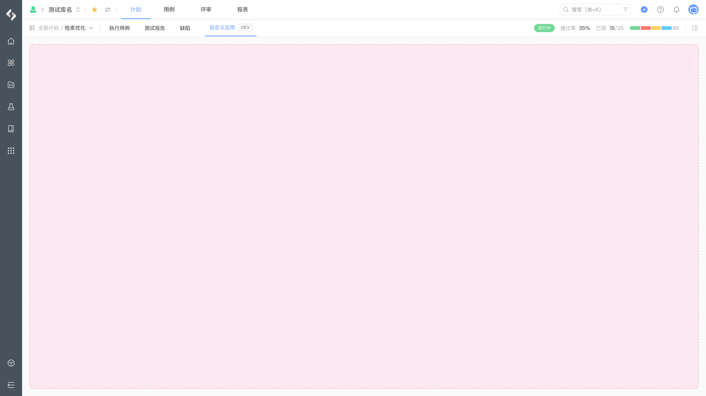</td></tr><tr><td><a href="/reference/resource/extensions/testhub-plan-action">测试计划 - 详情菜单</a></td><td><code>pcm:testhub:plan:action</code></td><td>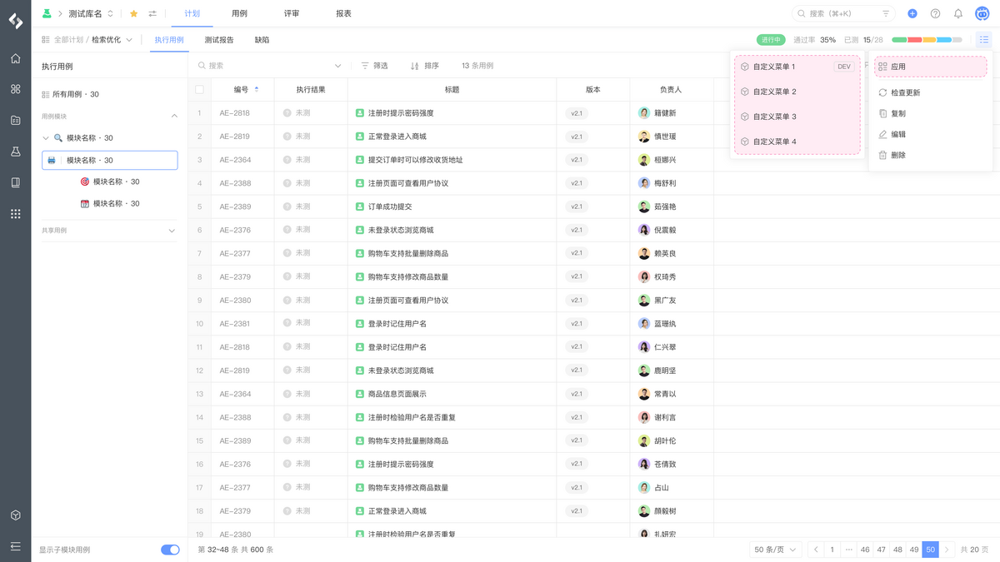</td></tr></tbody></table>

## 基线

<table style="width: 100%; table-layout: fixed"><colgroup><col style="width: 26.69%" /><col style="width: 37.85%" /><col style="width: 35.46%" /></colgroup><thead><tr><th>模块</th><th>定义</th><th>示例</th></tr></thead><tbody><tr><td><a href="/reference/resource/extensions/testhub-baseline-page">基线 - 详情导航</a></td><td><code>pcm:testhub:baseline:page</code></td><td>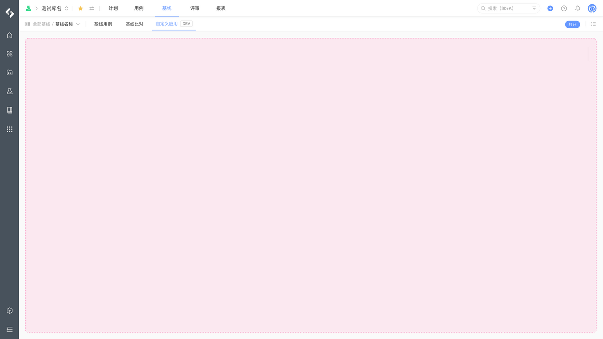</td></tr><tr><td><a href="/reference/resource/extensions/testhub-baseline-action">基线 - 详情菜单</a></td><td><code>pcm:testhub:baseline:action</code></td><td>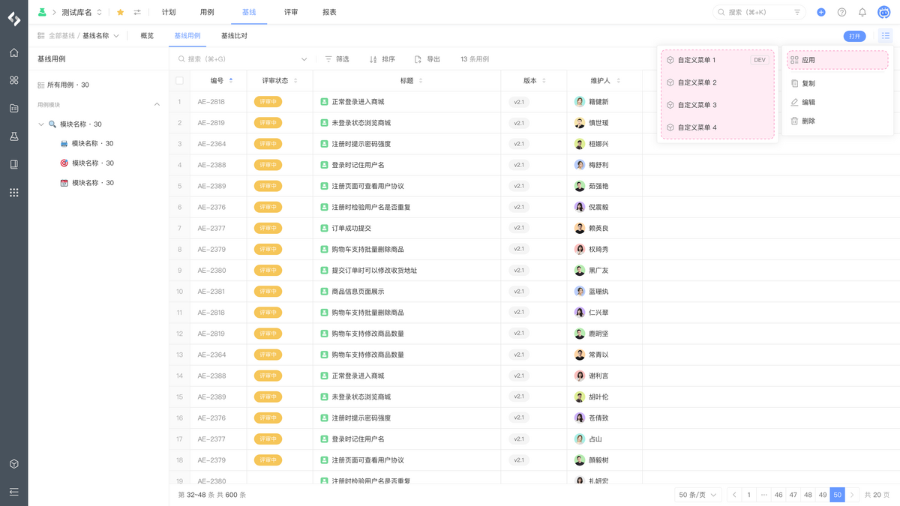</td></tr></tbody></table>
