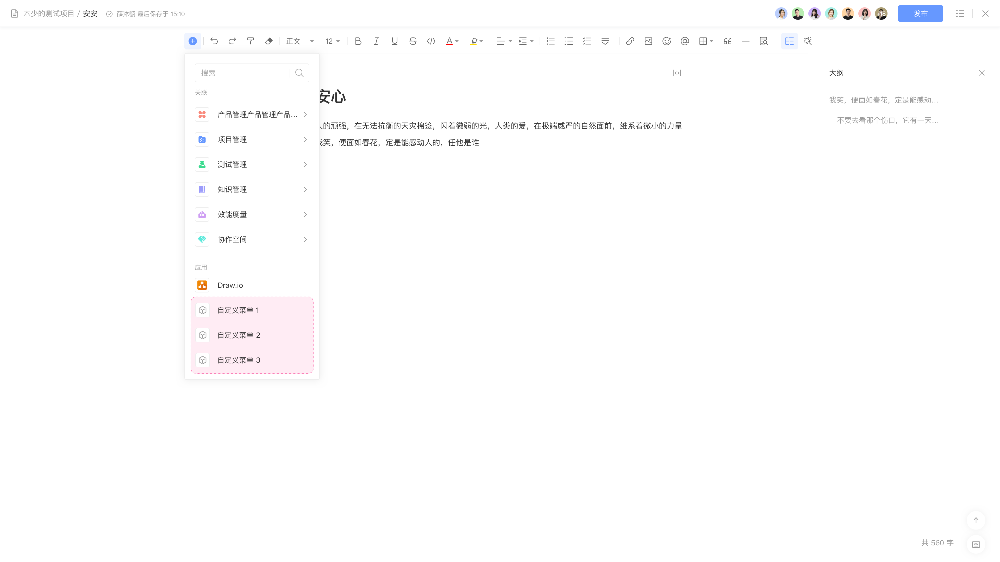
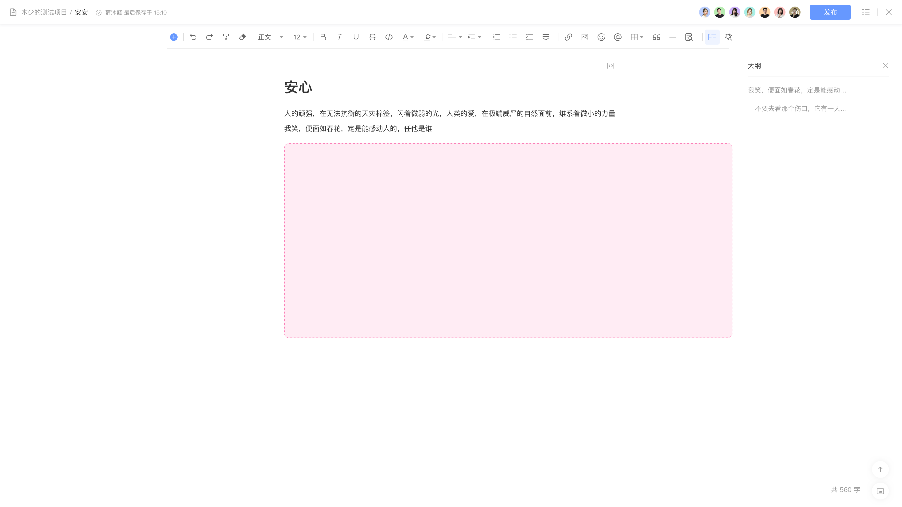

# 页面 - 文档内容块

页面详情编辑插入菜单扩展模块，允许在编辑页面的插入项中添加自定义菜单：





## 配置

配置结构：

```yaml
extensions []
├─ key (string) [Mandatory]
├─ target (string) [Mandatory]
├─ title (string | i18n) [Mandatory]
├─ icon (string) [Optional]
├─ resource (string) [Mandatory]
├─ resolver {} [Mandatory]
├─ behavior (string) [Mandatory]
├─ emitReadyEvent (boolean) [Optional]
├─ edit {} [Optional]
│  ├─ icon (string) [Optional]
│  ├─ title (string | i18n) [Optional]
│  ├─ resource (string) [Mandatory]
│  ├─ viewport {} [Optional]
│  │  └─ size (string) [Optional]
│  └─ openOnInsert (boolean) [Optional]
└─ fullscreen {} [Optional]
   ├─ resource (string) [Optional]
   └─ enabled (boolean) [Optional]
```

配置示例：

```yaml
extensions:
  - key: example-document-block
    target: "pcm:wiki:document:block"
    title: Block title
    icon: "resource:example-resource/icons/icon.svg"
    resource: main
    resolver:
      function: resolver
    behavior: modal
    emitReadyEvent: true
    edit:
      icon: "resource:example-resource/icons/icon.svg"
      title: Edit title
      resource: main
      viewport:
        size: medium
      openOnInsert: true
    fullscreen:
      resource: main
```

## 属性

配置属性：

<table style="width: 100%; table-layout: fixed"><colgroup><col style="width: 16.24%" /><col style="width: 16.95%" /><col style="width: 11.72%" /><col style="width: 55.09%" /></colgroup><thead><tr><th>属性</th><th>类型</th><th>必填</th><th>描述</th></tr></thead><tbody><tr><td><code>title</code></td><td><code>string \| i18n</code></td><td>Y</td><td>定义扩展模块的菜单项的标题，显示在页面编辑插入菜单中</td></tr><tr><td><code>icon</code></td><td><code>string</code></td><td></td><td>定义扩展模块的菜单项的图标</td></tr><tr><td><code>resource</code></td><td><code>string</code></td><td>Y</td><td>定义扩展模块所使用的资源，内容为 <code>resources</code> 节点的资源引用</td></tr><tr><td><code>resolver</code></td><td><code>{ function: string }</code>  或 <code>{ endpoint: string }</code></td><td>Y</td><td>定义扩展模块所使用的处理函数： - 指定后端处理函数时使用 <code>function</code> 属性 - 指定远程服务时使用 <code>endpoint</code> 属性</td></tr><tr><td><code>behavior</code></td><td><code>string</code></td><td>Y</td><td>定义扩展模块的菜单项的弹出框行为，默认 <code>model</code> ，可选 <code>dynamic</code></td></tr><tr><td><code>emitReadyEvent</code></td><td><code>boolean</code></td><td></td><td>通知 Nexus 当前扩展的业务内容已加载完成</td></tr><tr><td><code>edit</code></td><td><code>object</code></td><td></td><td>定义扩展模块的编辑弹窗，若需编辑，则配置 <code>edit</code> 属性</td></tr><tr><td><code>edit·icon</code></td><td><code>string</code></td><td></td><td>定义扩展模块编辑弹窗的图标</td></tr><tr><td><code>edit·title</code></td><td><code>string</code></td><td></td><td>定义扩展模块编辑弹窗的标题</td></tr><tr><td><code>edit·resource</code></td><td><code>string</code></td><td>Y</td><td>定义扩展模块编辑弹窗所包括的内容使用的资源，内容为 <code>resources</code> 节点的资源引用</td></tr><tr><td><code>edit·viewport</code></td><td><code>object</code></td><td></td><td>定义扩展模块编辑弹窗的尺寸</td></tr><tr><td><code>edit·viewport·size</code></td><td><code>string</code></td><td></td><td>定义扩展模块编辑弹窗的高度，默认高度自适应，可选 <code>small</code> , <code>medium</code> , <code>large</code> , <code>xlarge</code> , <code>max</code> , <code>fullscreen</code></td></tr><tr><td><code>edit·openOnInsert</code></td><td><code>boolean</code></td><td></td><td>定义点击扩展模块是否直接进入编辑弹窗，默认 <code>false</code> ,可选 <code>true</code></td></tr><tr><td><code>fullscreen</code></td><td><code>object</code></td><td></td><td>定义扩展模块的全屏菜单，若需全屏，则配置 <code>fullscreen</code> 属性</td></tr><tr><td><code>fullscreen·resource</code></td><td><code>string</code></td><td></td><td>定义扩展模块全屏菜单所包括的内容实用的资源，内容为 <code>resources</code> 节点的资源引用</td></tr></tbody></table>

## 扩展数据

当前模块可访问的扩展数据：

<table style="width: 100%; table-layout: fixed"><colgroup><col style="width: 29.94%" /><col style="width: 70.06%" /></colgroup><thead><tr><th>数据</th><th>说明</th></tr></thead><tbody><tr><td><code>space</code></td><td>空间数据 <a href="/reference/resource/context/space">space</a></td></tr><tr><td><code>page</code></td><td>页面数据 <a href="/reference/resource/context/page">page</a></td></tr><tr><td><code>config</code></td><td>调用 <code>view.submit()</code> 保存的自定义配置</td></tr></tbody></table>

## 限制

每个扩展模块对应的数量限制：

<table style="width: 100%; table-layout: fixed"><colgroup><col style="width: 30.08%" /><col style="width: 24.29%" /><col style="width: 45.63%" /></colgroup><thead><tr><th>限制项</th><th>限制</th><th>说明</th></tr></thead><tbody><tr><td>扩展模块数量</td><td><code>8</code></td><td>单个应用可以声明的当前扩展模块最大数量</td></tr></tbody></table>

## 桥接方法

当前扩展模块不支持以下桥接方法，详情请参考 [view](/reference/interface/bridge/view) 。

<table style="width: 100%; table-layout: fixed"><colgroup><col style="width: 49.44%" /><col style="width: 50.56%" /></colgroup><thead><tr><th>桥接方法</th><th>支持</th></tr></thead><tbody><tr><td><code>view.setWindowTitle</code></td><td>❌</td></tr><tr><td><code>view.refresh</code></td><td>❌</td></tr><tr><td><code>view.createHistory</code></td><td>❌</td></tr></tbody></table>
