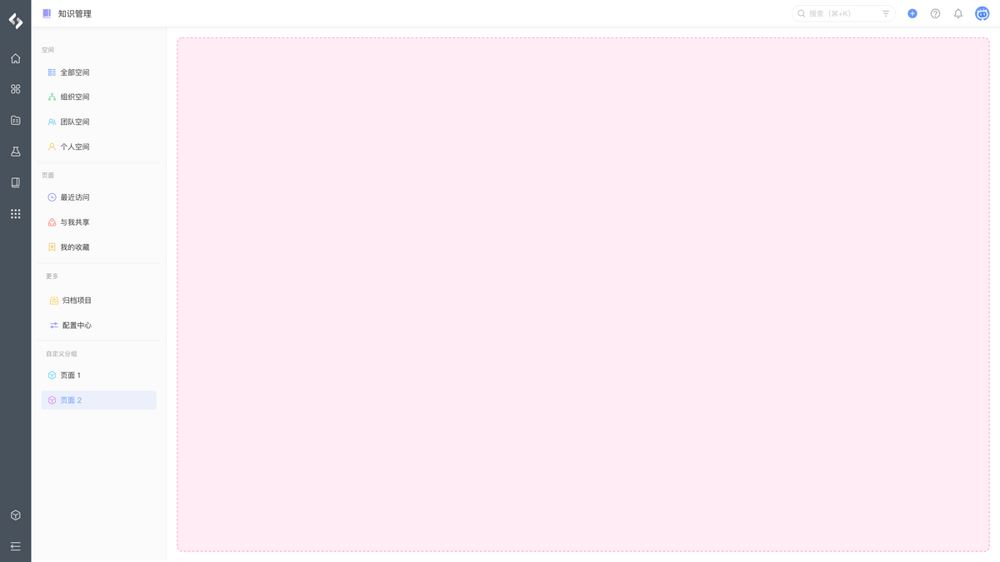
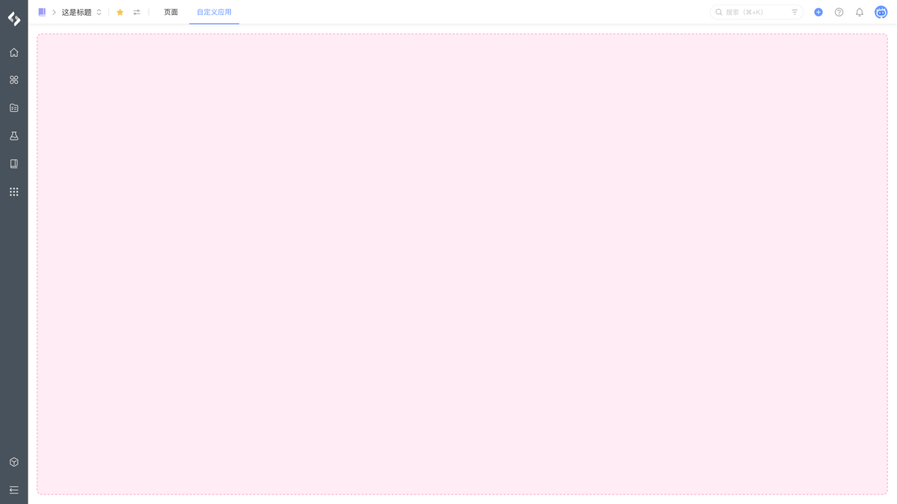
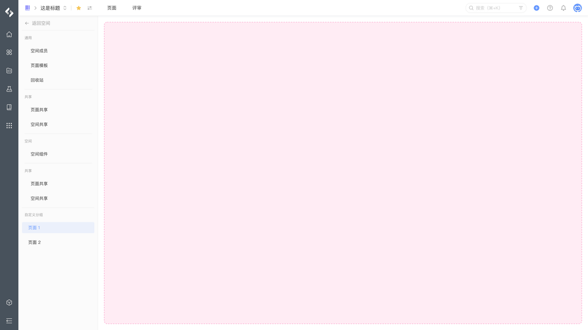
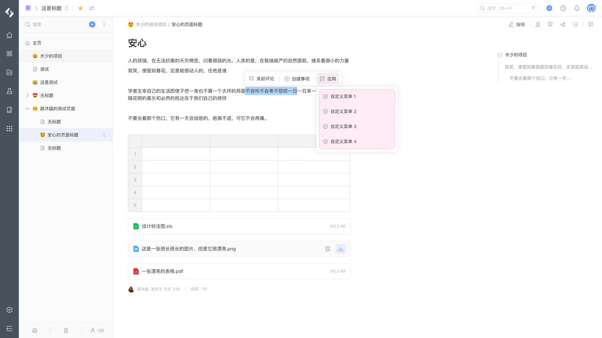
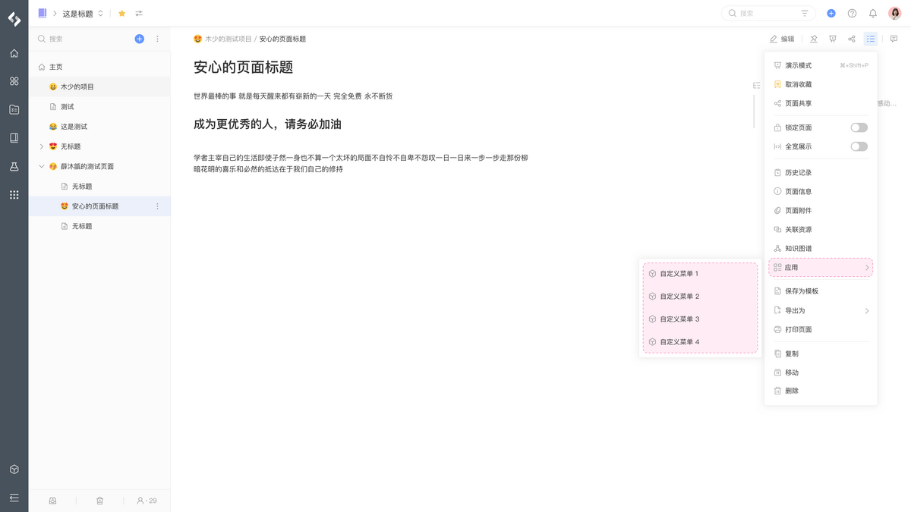
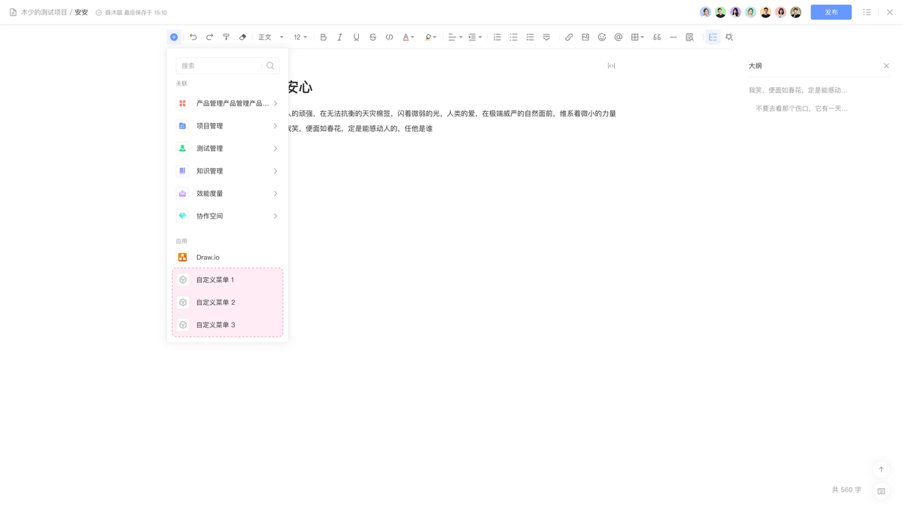
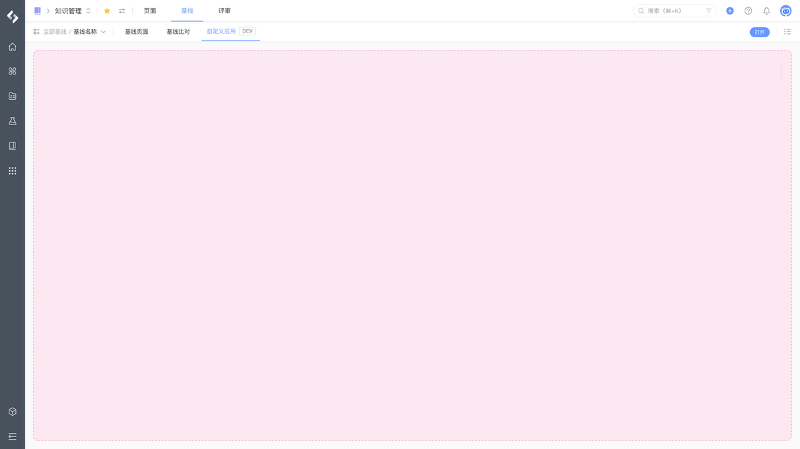
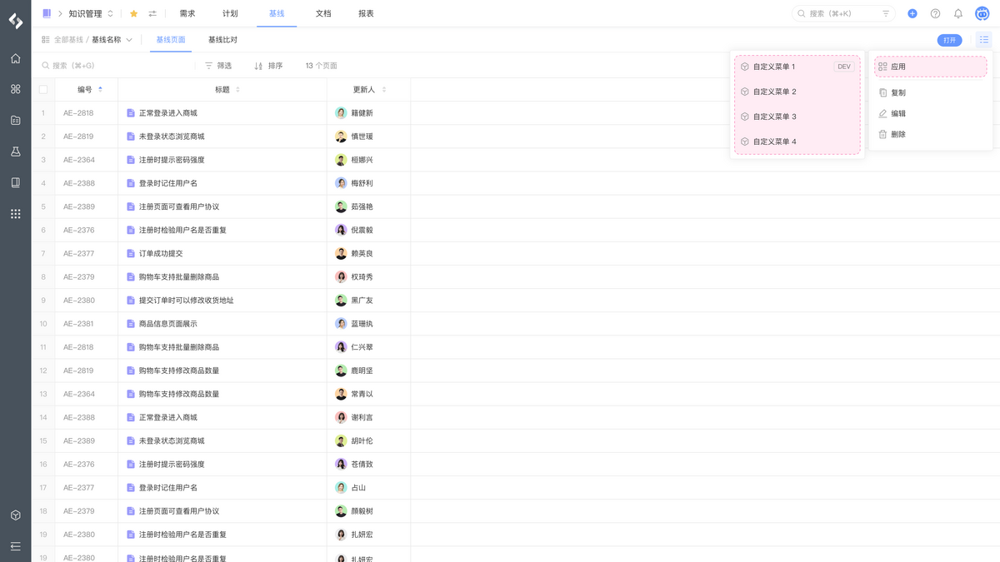

# 知识管理

在 PingCode 知识管理中，可以添加以下扩展模块来开发你的应用。

## 空间

<table style="width: 100%; table-layout: fixed"><colgroup><col style="width: 30.93%" /><col style="width: 38.28%" /><col style="width: 30.79%" /></colgroup><thead><tr><th>模块</th><th>定义</th><th>示例</th></tr></thead><tbody><tr><td><a href="/reference/resource/extensions/wiki-space-hub">空间 - 首页导航</a></td><td><code>pcm:wiki:space:hub</code></td><td></td></tr><tr><td><a href="/reference/resource/extensions/wiki-space-page">空间 - 组件页面</a></td><td><code>pcm:wiki:space:page</code></td><td></td></tr><tr><td><a href="/reference/resource/extensions/wiki-space-setting">空间 - 空间设置</a></td><td><code>pcm:wiki:space:setting</code></td><td></td></tr><tr><td><a href="/reference/resource/extensions/wiki-space-background">空间 - 首页后台脚本</a></td><td><code>pcm:wiki:space:background</code></td><td></td></tr></tbody></table>

## 页面

<table style="width: 100%; table-layout: fixed"><colgroup><col style="width: 30.93%" /><col style="width: 35.73%" /><col style="width: 33.34%" /></colgroup><thead><tr><th>模块</th><th>定义</th><th>示例</th></tr></thead><tbody><tr><td><a href="/reference/resource/extensions/wiki-context-action">页面 - 上下文操作</a></td><td><code>pcn:wiki:context:action</code></td><td></td></tr><tr><td><a href="/reference/resource/extensions/wiki-page-action">页面 - 详情菜单</a></td><td><code>pcm:wiki:page:action</code></td><td></td></tr><tr><td><a href="/reference/resource/extensions/wiki-document-block">页面 - 文档内容块</a></td><td><code>pcm:wiki:document:block</code></td><td></td></tr><tr><td><a href="/reference/resource/extensions/wiki-page-background">页面 - 详情后台脚本</a></td><td><code>pcm:wiki:page:background</code></td><td></td></tr></tbody></table>

## 基线

<table style="width: 100%; table-layout: fixed"><colgroup><col style="width: 31.21%" /><col style="width: 35.45%" /><col style="width: 33.34%" /></colgroup><thead><tr><th>模块</th><th>定义</th><th>示例</th></tr></thead><tbody><tr><td><a href="/reference/resource/extensions/wiki-baseline-page">基线 - 详情导航</a></td><td><code>pcm:wiki:baseline:page</code></td><td></td></tr><tr><td><a href="/reference/resource/extensions/wiki-baseline-action">基线 - 详情菜单</a></td><td><code>pcm:wiki:baseline:action</code></td><td></td></tr></tbody></table>
